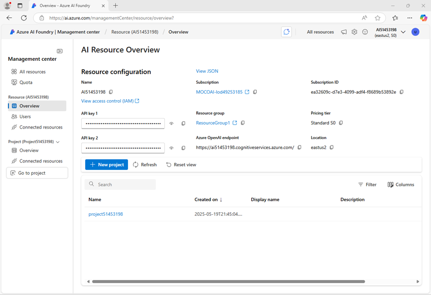
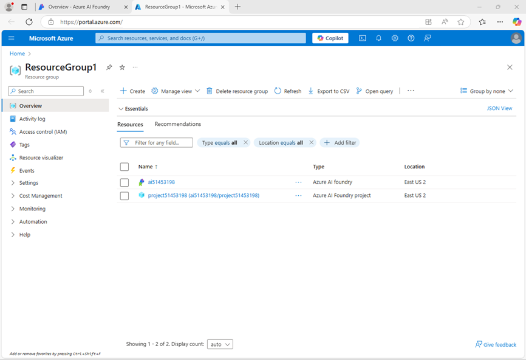
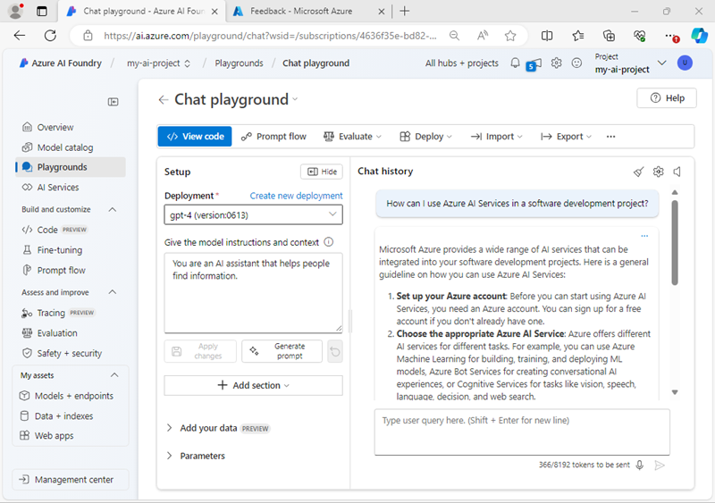

---
lab:
    title: 'Prepare for an AI development project'
    description: 'Learn how to organize cloud resources in Azure AI Foundry projects so that developers are set up for success when building AI solutions.'
---

# Prepare for an AI development project

In this exercise, you use Azure AI Foundry portal to create a project, ready to build an AI solution.

This exercise takes approximately **30** minutes.

> **Note**: Some of the technologies used in this exercise are in preview or in active development. You may experience some unexpected behavior, warnings, or errors.

## Open Azure AI Foundry portal

Let's start by signing into Azure AI Foundry portal.

1. In a web browser, open the [Azure AI Foundry portal](https://ai.azure.com) at `https://ai.azure.com` and sign in using your Azure credentials. Close any tips or quick start panes that are opened the first time you sign in, and if necessary use the **Azure AI Foundry** logo at the top left to navigate to the home page, which looks similar to the following image (close the **Help** pane if it's open):

    

1. Review the information on the home page.

## Create a project

An Azure AI *project* provides a collaborative workspace for AI development. Let's start by choosing a model that we want to work with and creating a project to use it in.

> **Note**: AI Foundry projects can be based on an *Azure AI Foundry* resource, which provides access to AI models (including Azure OpenAI), Azure AI services, and other resources for developing AI agents and chat solutions. Alternatively, projects can be based on *AI hub* resources; which include connections to Azure resources for secure storage, compute, and specialized tools. Azure AI Foundry based projects are great for developers who want to manage resources for AI agent or chat app development. AI hub based projects are more suitable for enterprise development teams working on complex AI solutions.

1. In the home page, in the **Explore models and capabilities** section, search for the `gpt-4o` model; which we'll use in our project.
1. In the search results, select the **gpt-4o** model to see its details, and then at the top of the page for the model, select **Use this model**.
1. When prompted to create a project, enter a valid name for your project and expand **Advanced options**.
1. Select **Customize** and specify the following settings for your project:
    - **Azure AI Foundry resource**: *A valid name for your Azure AI Foundry resource*
    - **Subscription**: *Your Azure subscription*
    - **Resource group**: *Create or select a resource group*
    - **Region**: *Select any **AI Foundry recommended***\*

    > \* Some Azure AI resources are constrained by regional model quotas. In the event of a quota limit being exceeded later in the exercise, there's a possibility you may need to create another resource in a different region.

1. Select **Create** and wait for your project to be created. If prompted, deploy the gpt-4o model using the **Global standard** deployment type and customize the deployment details to set a **Tokens per minute rate limit** of 50K (or the maximum available if less than 50K).

    > **Note**: Reducing the TPM helps avoid over-using the quota available in the subscription you are using. 50,000 TPM should be sufficient for the data used in this exercise. If your available quota is lower than this, you will be able to complete the exercise but you may experience errors if the rate limit is exceeded.

1. When your project is created, the chat playground will be opened automatically so you can test your model:

    

1. In the navigation pane on the left, select **Overview** to see the main page for your project; which looks like this:

    

1. At the bottom of the navigation pane on the left, select **Management center**. The management center is where you can configure settings at both the *resource* and *project* levels; which are both shown in the navigation pane.

    

    The *resource* level relates to the **Azure AI Foundry** resource that was created to support your project. This resource includes connections to Azure AI Services and Azure AI Foundry models; and provides a centralplace to manage user access to AI development projects.

    The *project* level relates to your individual project, where you can add and manage project-specific resources.

1. In the navigation pane, in the section for your Azure AI Foundry resource, select the **Overview** page to view its details.
1. Select the link to the **Resource group** associated with the resource to open a new browser tab and navigate to the Azure portal. Sign in with your Azure credentials if prompted.
1. View the resource group in the Azure portal to see the Azure resources that have been created to support your Azure AI Foundry resource and your project.

    

    Note that the resources have been created in the region you selected when creating the project.

1. Close the Azure portal tab and return to the Azure AI Foundry portal.

## Review project endpoints

The Azure AI Foundry project includes a number of *endpoints* that client applications can use to connect to the project and the models and AI services it includes.

1. In the Management center page, in the navigation pane, under your project, select **Go to project**.
1. In the project **Overview** page, view the **Endpoints and keys** section; which contains endpoints and authorization keys that you can use in your application code to access:
    - The Azure AI Foundry project and any models deployed in it.
    - Azure OpenAI in Azure AI Foundry models.
    - Azure AI services

## Test a generative AI model

Now that you know something about the configuration of your Azure AI Foundry project, you can return to the chat playground to explore the model you deployed.

1. In the navigation pane on the left for your project, select **Playgrounds** 
1. Open the **Chat playground**, and ensure that your **gpt-4o** model deployment is selected in the **Deployment** section.
1. In the **Setup** pane, in the **Give the model instructions and context** box, enter the following instructions:

    ```
   You are a history teacher who can answer questions about past events all around the world.
    ```

1. Apply the changes to update the system message.
1. In the chat window, enter a query such as `What are the key events in the history of Scotland?` and view the response:

    

## Summary

In this exercise, you've explored Azure AI Foundry, and seen how to create and manage projects and their related resources.

## Clean up

If you've finished exploring Azure AI Foundry portal, you should delete the resources you have created in this exercise to avoid incurring unnecessary Azure costs.

1. In the [Azure portal](https://portal.azure.com) at `https://portal.azure.com`, view the contents of the resource group where you deployed the resources used in this exercise.
1. On the toolbar, select **Delete resource group**.
1. Enter the resource group name and confirm that you want to delete it.
