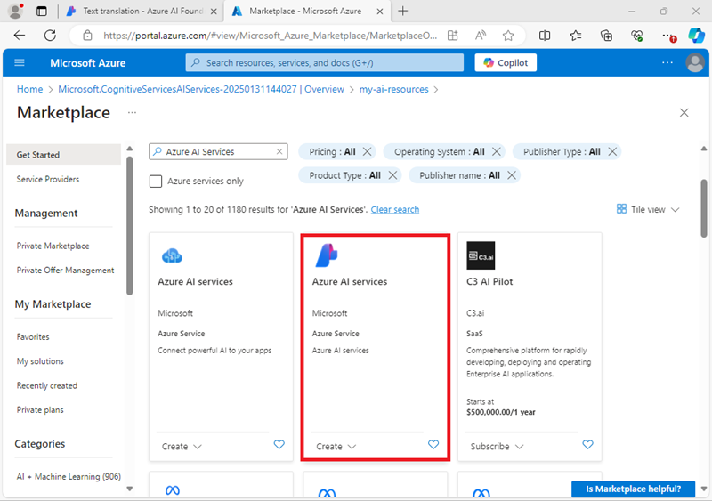
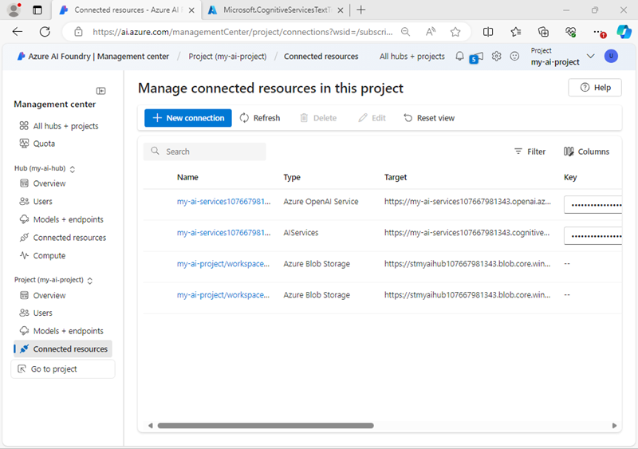
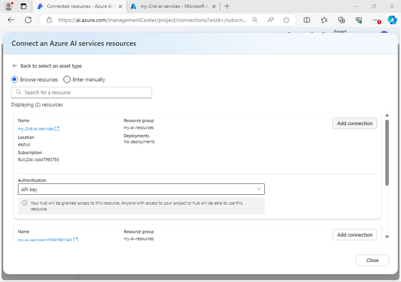
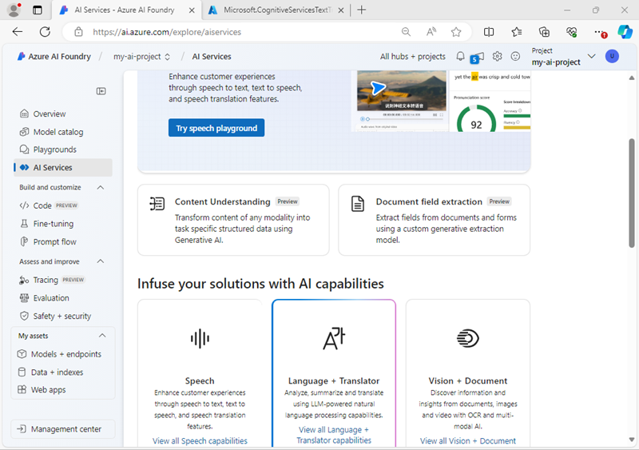
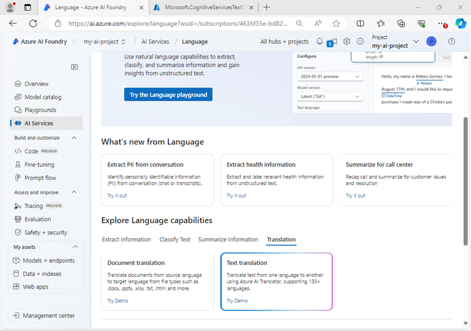
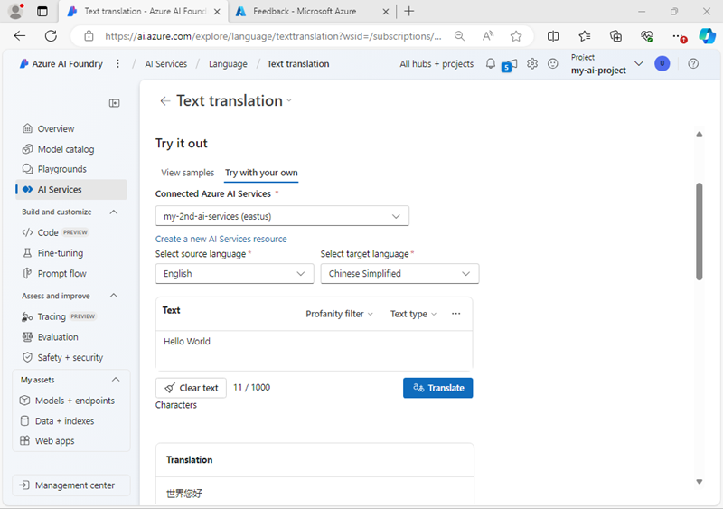

---
lab:
    title: 'Prepare for an AI development project'
    description: 'Learn how to organize cloud resources in hubs and projects so that developers are set up for success when building AI solutions.'
---

# Prepare for an AI development project

In this exercise, you use Azure AI Foundry portal to create a hub and project, ready for a team of developers to build an AI solution.

This exercise takes approximately **30** minutes.

> **Note**: Some of the technologies used in this exercise are in preview or in active development. You may experience some unexpected behavior, warnings, or errors.

## Open Azure AI Foundry portal

Let's start by signing into Azure AI Foundry portal.

1. In a web browser, open the [Azure AI Foundry portal](https://ai.azure.com) at `https://ai.azure.com` and sign in using your Azure credentials. Close any tips or quick start panes that are opened the first time you sign in, and if necessary use the **Azure AI Foundry** logo at the top left to navigate to the home page, which looks similar to the following image (close the **Help** pane if it's open):

    

1. Review the information on the home page.

## Create a hub and project

An Azure AI *hub* provides a collaborative workspace within which you can define one or more *projects*. Let's create a project and Azure AI hub and review the Azure resources that are created to support them.

1. In the home page, select **+ Create project**.
1. In the **Create a project** wizard, enter a valid name for your project and if an existing hub is suggested, choose the option to create a new one. Then review the Azure resources that will be automatically created to support your hub and project.
1. Select **Customize** and specify the following settings for your hub:
    - **Hub name**: *A valid name for your hub*
    - **Subscription**: *Your Azure subscription*
    - **Resource group**: *Create or select a resource group*
    - **Location**: Select **Help me choose** and then select **gpt-4o** in the Location helper window and use the recommended region\*
    - **Connect Azure AI Services or Azure OpenAI**: *Create a new AI Services resource*
    - **Connect Azure AI Search**: Skip connecting

    > \* Azure OpenAI resources are constrained by regional model quotas. In the event of a quota limit being exceeded later in the exercise, there's a possibility you may need to create another resource in a different region.

1. Select **Next** and review your configuration. Then select **Create** and wait for the process to complete.
1. When your project is created, close any tips that are displayed and review the project page in Azure AI Foundry portal, which should look similar to the following image:

    

1. At the bottom of the navigation pane on the left, select **Management center**. The management center is where you can configure settings at both the *hub* and *project* levels; which are both shown in the navigation pane.

    

    Note that in the navigation pane, you can view and manage hub and project level assets in the following pages:

    - Overview
    - Users
    - Models and endpoints
    - Connected resources
    - Compute (*hub-level only*)

    > **Note**: Depending on the permissions assigned to your Entra ID in your Azure tenant, you may not be able to manage resources at the hub level.

1. In the navigation pane, in the section for your hub, select the **Overview** page to view details of your hub. 
1. In the **Hub properties** pane, select the link to the resource group associated with the hub to open a new browser tab and navigate to the Azure portal. Sign in with your Azure credentials if prompted.
1. View the resource group in the Azure portal to see the Azure resources that have been created to support your hub and project.

    

    Note that the resources have been created in the region you selected when creating the hub.

## Add a connected resource

Suppose your project needs access to a second **Azure AI Services** resource in a different region.

1. In the Azure portal, in the page for your resource group, select **+ Create** and search for `Azure AI Services`. In the results, select the **Azure AI Services** multi-service resource as shown in the following image:

    

1. Create a new **Azure AI Services** resource with the following settings:
    - **Subscription**: *Your Azure subscription*
    - **Resource group**: *The resource group containing your existing Azure AI Foundry resources*
    - **Region**: *Select any available region other than the one containing your existing resources*
    - **Name**: *A suitable name for your second Azure AI Services resource*
    - **Pricing tier**: Standard S0
1. Wait for the AI Services resource to be created.
1. Return to the Azure AI Foundry portal browser tab, and in the **Management center** view, in the navigation pane, in the section for your *<u>project</u>*, view the **Connected resources** page. The existing connected resources in your project are listed.

    

1. Select **+ New connection** and select the **Azure AI Services** resource type. Then browse the available resources to find the AI Services resource you created in the Azure portal and use its **Add Connection** button to add it to your project.

    

1. When the new resource is connected, close the **Connect an Azure AI services resources** dialog box and verify that new connected resources for Azure AI Services and Azure OpenAI Service are listed.

## Explore AI Services

Your Azure AI Foundry project has access to Azure AI Services. Let's try that out in the portal.

1. In the Management center page, in the navigation pane, under your project, select **Go to project**.
1. In the navigation pane for your project, select **AI Services** and select the **Language and Translator** tile.

    

1. In the **Explore Language capabilities** section, view the **Translation** tab and select **Text translation**.

    

1. In the **Text translation** page, in the **Try it out** section, view the **Try with your own** tab.
1. Select either of your Azure AI Services resources and then try translating some text (for example, `Hello world`) from one language to another.

    

## Deploy and test a generative AI model

Your project also contains connected resources for Azure OpenAI, which enables you to use Azure OpenAI language models to implement generative AI solutions. You can also find and use generative AI models from other vendors in the model catalog.

1. In the pane on the left for your project, in the **My assets** section, select the **Models + endpoints** page.
1. In the **Models + endpoints** page, in the **Model deployments** tab, in the **+ Deploy model** menu, select **Deploy base model**.
1. Search for the **gpt-4o** model in the list, and then select and confirm it.
1. Deploy the model with the following settings by selecting **Customize** in the deployment details:
    - **Deployment name**: *A valid name for your model deployment*
    - **Deployment type**: Global Standard
    - **Automatic version update**: Enabled
    - **Model version**: *Select the most recent available version*
    - **Connected AI resource**: *Select your Azure OpenAI resource connection*
    - **Tokens per Minute Rate Limit (thousands)**: 50K *(or the maximum available in your subscription if less than 50K)*
    - **Content filter**: DefaultV2

    > **Note**: Reducing the TPM helps avoid over-using the quota available in the subscription you are using. 50,000 TPM should be sufficient for the data used in this exercise. If your available quota is lower than this, you will be able to complete the exercise but you may experience errors if the rate limit is exceeded.

1. Wait for the deployment to complete.

1. After the model has been deployed, in the deployment overview page, select **Open in playground**.
1. In the **Chat playground** page, ensure that your model deployment is selected in the **Deployment** section.
1. In the **Setup** pane, in the **Give the model instructions and context** box, enter the following instructions:

    ```
    You are a history teacher who can answer questions about past events all around the world.
    ```

1. Apply the changes to update the system message.
1. In the chat window, enter a query such as `What are the key events in the history of Scotland?` and view the response:

    

## Summary

In this exercise, you've explored Azure AI Foundry, and seen how to create and manage hubs and projects, add connected resources, and explore Azure AI Services and Azure OpenAI models in the Azure AI Foundry portal.

## Clean up

If you've finished exploring Azure AI Foundry portal, you should delete the resources you have created in this exercise to avoid incurring unnecessary Azure costs.

1. Return to the browser tab containing the Azure portal (or re-open the [Azure portal](https://portal.azure.com) at `https://portal.azure.com` in a new browser tab) and view the contents of the resource group where you deployed the resources used in this exercise.
1. On the toolbar, select **Delete resource group**.
1. Enter the resource group name and confirm that you want to delete it.
