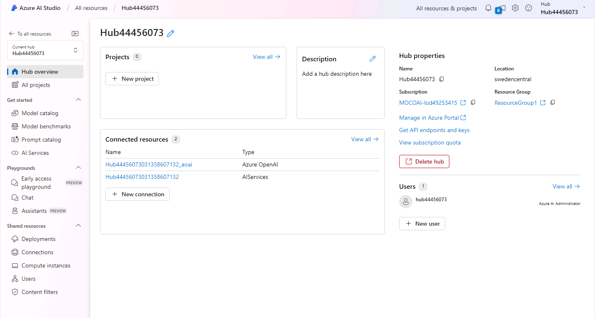

---
lab:
    title: 'Explore, deploy, and chat with language models in the Azure AI Foundry'
---

# Explore, deploy, and chat with language models in the Azure AI Foundry

The Azure AI Foundry model catalog serves as a central repository where you can explore and use a variety of models, facilitating the creation of your generative AI scenario.

In this exercise, you'll explore the model catalog in Azure AI Foundry portal.

This exercise will take approximately **25** minutes.

## Create an Azure AI hub and project

An Azure AI hub provides a collaborative workspace within which you can define one or more *projects*. Let's create a project and Azure AI hub.

1. In a web browser, open [Azure AI Foundry portal](https://ai.azure.com) at `https://ai.azure.com` and sign in using your Azure credentials.

1. In the home page, select **+ Create project**. In the **Create a project** wizard you can see all the Azure resources that will be automatically created with your project, or you can customize the following settings by selecting **Customize** before selecting **Create**:

    - **Hub name**: *A unique name*
    - **Subscription**: *Your Azure subscription*
    - **Resource group**: *A new resource group*
    - **Location**: Select **Help me choose** and then select **gpt-35-turbo** in the Location helper window and use the recommended region\*
    - **Connect Azure AI Services or Azure OpenAI**: (New) *Autofills with your selected hub name*
    - **Connect Azure AI Search**: Skip connecting

    > \* Azure OpenAI resources are constrained at the tenant level by regional quotas. The listed regions in the location helper include default quota for the model type(s) used in this exercise. Randomly choosing a region reduces the risk of a single region reaching its quota limit. In the event of a quota limit being reached later in the exercise, there's a possibility you may need to create another resource in a different region. Learn more about [model availability per region](https://learn.microsoft.com/azure/ai-services/openai/concepts/models#gpt-35-turbo-model-availability)

1. If you selected **Customize**, select **Next** and review your configuration.
1. Select **Create** and wait for the process to complete.
   
    After the Azure AI hub and project have been created, it should look similar to the following image:

    

1. Open a new browser tab (leaving the Azure AI Foundry portal tab open) and browse to the Azure portal at [https://portal.azure.com](https://portal.azure.com?azure-portal=true), signing in with your Azure credentials if prompted.
1. Browse to the resource group where you created your Azure AI hub, and view the Azure resources that have been created.

    

1. Return to the Azure AI Foundry portal browser tab.
1. View each of the pages in the pane on the left side of the page for your Azure AI hub, and note the artifacts you can create and manage. In the **Management center** page, you can select **Connected resources**, either under your hub or your project, and observe that connections to Azure OpenAI and AI services have already been created.
1. If you are in the Management center page, select **Go to project**.

## Choose a model using model benchmarks

Before deploying a model, you can explore the model benchmarks to decide which model best fits your needs.

Imagine you want to create a custom copilot that serves as a travel assistant. Specifically, you want your copilot to offer support for travel-related inquiries, such as visa requirements, weather forecasts, local attractions, and cultural norms.

Your copilot will need to provide factually accurate information, so groundedness is important. Next to that, you want the copilot's answers to be easy to read and understand. Therefore, you also want to pick a model that rates high on fluency and coherence.

1. In the Azure AI Foundry project portal, navigate to **Model catalog** using the menu on the left.
    In the catalog page, select **Compare with benchmarks**. In the Model benchmarks page, you will find a chart already plotted for you, comparing different models.
1. Select **+ Model to compare** and add **gpt-4-32k** and **gpt-4** to the metrics chart. In the **X-axis** dropdown menu, under **Quality**, select the following metrics and observe each resulting chart before switching to the next:
    - Coherence
    - Fluency
    - Groundedness
1. When exploring the results, you can try and answer the following questions:
    - Do you notice a difference in performance between GPT-3.5 and GPT-4 models?
    - Is there a difference between versions of the same model?
    - How does the 32k variant of GPT-4 differ from the base model?

From the Azure OpenAI collection, you can choose between GPT-3.5 and GPT-4 models. Let's deploy these two models and explore how they compare for your use case.

## Deploy Azure OpenAI models

Now that you have explored your options through model benchmarks, you're ready to deploy language models. You can browse the model catalog, and deploy from there, or you can deploy a model through the **Deployments** page. Let's explore both options.

### Deploy a model from the Model catalog

Let's start by deploying a model from the Model catalog. You may prefer this option when you want to filter through all available models.

1. Navigate to the **Model catalog** page using the menu on the left.
1. Search for and deploy the `gpt-35-turbo` model, curated by Azure AI, with the following settings by selecting **Customize** in the deployment details:
   
    - **Deployment name**: *A unique name for your model deployment*
    - **Deployment type**: Standard
    - **Model version**: *Select the default version*
    - **AI resource**: *Select the resource created previously*
    - **Tokens per Minute Rate Limit (thousands)**: 5K
    - **Content filter**: DefaultV2
    - **Enable dynamic quota**: Disabled

    > **Note**: If your current AI resource location doesn't have quota available for the model you want to deploy, you will be asked to choose a different location where a new AI resource will be created and connected to your project.

### Deploy a model through Models + endpoints

If you already know exactly which model you want to deploy, you may prefer to do it through **Models + endpoints**.

1. Navigate to the **Models + endpoints** page under the **My assets** section, using the menu on the left.
1. In the **Model deployments** tab, deploy a new base model with the following settings by selecting **Customize** in the deployment details:
    - **Model**: gpt-4
    - **Deployment name**: *A unique name for your model deployment*
    - **Deployment type**: Standard
    - **Model version**: *Select the default version*
    - **AI resource**: *Select the resource created previously*
    - **Tokens per Minute Rate Limit (thousands)**: 5K
    - **Content filter**: DefaultV2
    - **Enable dynamic quota**: Disabled

## Test your models in the chat playground

Now that we have two models to compare, let's see how the models behave in a conversational interaction.

1. Navigate to the **Playgrounds** page using the menu on the left.
1. In the **Chat playground**, select your GPT-3.5 deployment.
1. In the chat window, enter the query `What can you do?` and view the response.
    The answers are very generic. Remember we want to create a custom copilot that serves as a travel assistant. You can specify what kind of help you want in the question you ask.
1. In the chat window, enter the query `Imagine you're a travel assistant, what can you help me with?`
    The answers are already more specific. You may not want your end-users to have to provide the necessary context every time they interact with your copilot. To add global instructions, you can edit the system message.
1. Under **Setup**, update the **Give the model instructions and context** field with the following prompt:

   ```
   You are an AI travel assistant that helps people plan their trips. Your objective is to offer support for travel-related inquiries, such as visa requirements, weather forecasts, local attractions, and cultural norms.
   ```

1. Select **Apply changes**.
1. In the chat window, enter the query `What can you do?` and view the new response. Observe how it's different from the answer you received before. The answer is specific to travel now.
1. Continue the conversation by asking: `I'm planning a trip to London, what can I do there?`
    The copilot offers a lot of travel related information. You may want to improve the output still. For example, you may want the answer to be more succinct.
1. Update the system message by adding `Answer with a maximum of two sentences.` to the end of the message. Apply the change, clear the chat, and test the chat again by asking: `I'm planning a trip to London, what can I do there?`
    You may also want your copilot to continue the conversation instead of simply answering the question.
1. Update the model's context by adding `End your answer with a follow-up question.` to the end of the prompt. Save the change and test the chat again by asking: `I'm planning a trip to London, what can I do there?`
1. Change your **Deployment** to your GPT-4 model and repeat all steps in this section. Notice how the models may vary in their outputs.
1. Finally, test both models on the query `Who is the prime minister of the UK?`. The performance on this question is related to the groundedness (whether the response is factually accurate) of the models. Does the performance correlate with your conclusions from the Model benchmarks?

Now that you have explored both models, consider what model you would choose now for your use case. At first, the outputs from the models may differ, and you may prefer one model over the other. However, after updating the system message, you may notice that the difference is minimal. From a cost optimization perspective, you may then opt for the GPT-3.5 model over the GPT-4 model, as their performance is very similar.

## Clean up

If you've finished exploring Azure AI Foundry portal, you should delete the resources you have created in this exercise to avoid incurring unnecessary Azure costs.

1. Return to the browser tab containing the Azure portal (or re-open the [Azure portal](https://portal.azure.com?azure-portal=true) in a new browser tab) and view the contents of the resource group where you deployed the resources used in this exercise.
1. On the toolbar, select **Delete resource group**.
1. Enter the resource group name and confirm that you want to delete it.
