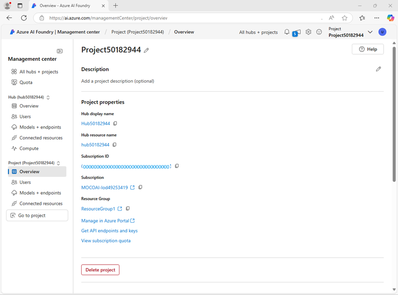
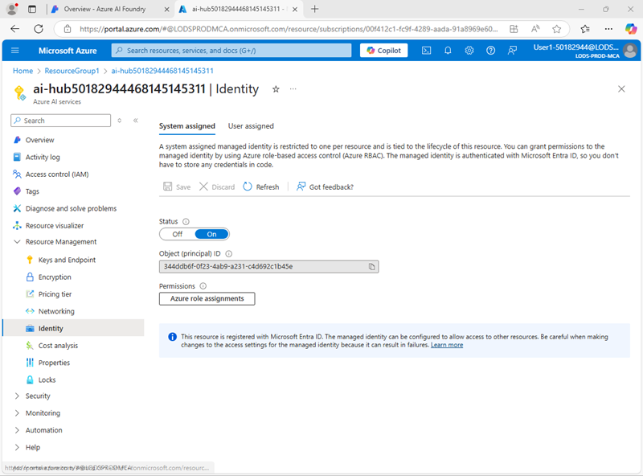
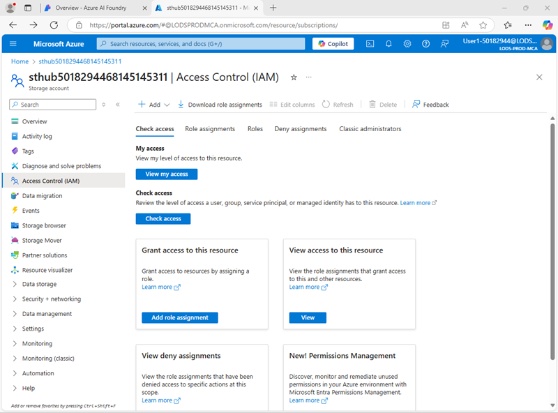
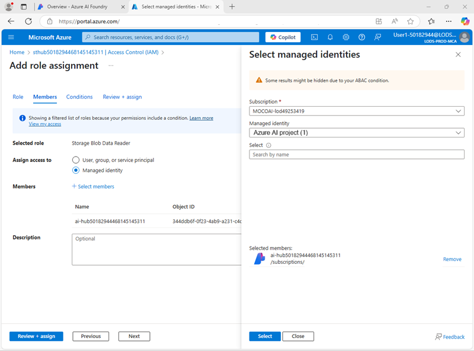
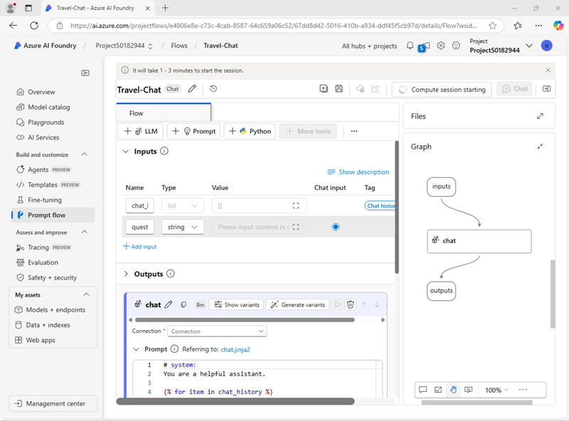
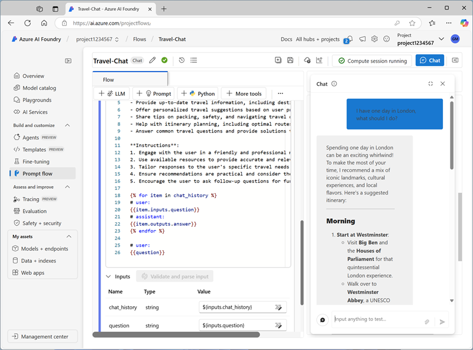
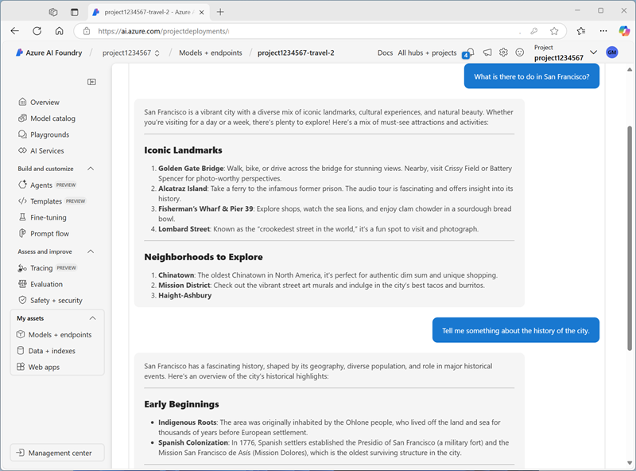

---
lab:
    title: 'Use a prompt flow to manage conversation in a chat app'
    description: 'Learn how to use prompt flows to manage conversational dialogs and ensure that prompts are constructed and orchestrated for best results.'
---

## **<font color="red">This exercise is no longer available.</font>**


Use a prompt flow to manage conversation in a chat app

In this exercise, you'll use Azure AI Foundry portal's prompt flow to create a custom chat app that uses a user prompt and chat history as inputs, and uses a GPT model from Azure OpenAI to generate an output.

This exercise will take approximately **30** minutes.

> **Note**: Some of the technologies used in this exercise are in preview or in active development. You may experience some unexpected behavior, warnings, or errors.

## Deploy a model in an Azure AI Foundry project

Let's start by deploying a model in an Azure AI Foundry project.

1. In the home page, in the **Explore models and capabilities** section, search for the `gpt-4o` model; which we'll use in our project.
1. In the search results, select the **gpt-4o** model to see its details, and then at the top of the page for the model, select **Use this model**.
1. When prompted to create a project, enter a valid name for your project and expand **Advanced options**.
1. Select **Customize** and specify the following settings for your hub:
    - **Azure AI Foundry resource**: *A valid name for your Azure AI Foundry resource*
    - **Subscription**: *Your Azure subscription*
    - **Resource group**: *Create or select a resource group*
    - **Region**: *Select any **AI Services supported location***\*

    > \* Some Azure AI resources are constrained by regional model quotas. In the event of a quota limit being exceeded later in the exercise, there's a possibility you may need to create another resource in a different region.

1. Select **Create** and wait for your project, including the gpt-4 model deployment you selected, to be created.
1. When your project is created, the chat playground will be opened automatically.
1. In the **Setup** pane, note the name of your model deployment; which should be **gpt-4o**. You can confirm this by viewing the deployment in the **Models and endpoints** page (just open that page in the navigation pane on the left).
1. In the navigation pane on the left, select **Overview** to see the main page for your project; which looks like this:

    > **Note**: If an *Insufficient permissions** error is displayed, use the **Fix me** button to resolve it.

    

## Configure resource authorization

The prompt flow tools in Azure AI Foundry create file-based assets that define the prompt flow in a folder in blob storage. Before exploring prompt flow, let's ensure that your Azure AI Foundry resource has the required access to the blob store so it can read them.

1. In the Azure AI Foundry portal, in the navigation pane, select the **Management center** and view the details page for your project, which looks similar to this image:

    

1. Under **Resource Group**, select your resource group to open it in the Azure portal in a new browser tab; signing in with your Azure credentials if prompted and closing any welcome notifications to see the resource group page.

    The resource group contains all of the Azure resources to support your hub and project.

1. Select the **Azure AI Services** resource for your hub to open it. Then expand its **Under Resource Management** section and select the **Identity** page:

    

1. If the status of the system assigned identity is **Off**, switch it **On** and save your changes. Then wait for the change of status to be confirmed.
1. Return to the resource group page, and then select the **Storage account** resource for your hub and view its **Access Control (IAM)** page:

    

1. Add a role assignment to the `Storage blob data reader` role for the managed identity used by your Azure AI Services resource:

    

1. When you've reviewed and assigned the role access to allow the Azure AI Services managed identity to read blobs in the storage account, close the Azure portal tab and return to the Azure AI Foundry portal.
1. In the Azure AI Foundry portal, in the navigation pane, select **Go to project** to return to your project's home page.

## Deploy a generative AI model

Now you're ready to deploy a generative AI language model to support your prompt flow application.

1. In the pane on the left for your project, in the **My assets** section, select the **Models + endpoints** page.
1. In the **Models + endpoints** page, in the **Model deployments** tab, in the **+ Deploy model** menu, select **Deploy base model**.
1. Search for the **gpt-4o** model in the list, and then select and confirm it.
1. Deploy the model with the following settings by selecting **Customize** in the deployment details:
    - **Deployment name**: *A valid name for your model deployment*
    - **Deployment type**: Global Standard
    - **Automatic version update**: Enabled
    - **Model version**: *Select the most recent available version*
    - **Connected AI resource**: *Select your Azure OpenAI resource connection*
    - **Tokens per Minute Rate Limit (thousands)**: 50K *(or the maximum available in your subscription if less than 50K)*
    - **Content filter**: DefaultV2

    > **Note**: Reducing the TPM helps avoid over-using the quota available in the subscription you are using. 50,000 TPM should be sufficient for the data used in this exercise. If your available quota is lower than this, you will be able to complete the exercise but you may experience errors if the rate limit is exceeded.

1. Wait for the deployment to complete.

## Create a prompt flow

A prompt flow provides a way to orchestrate prompts and other activities to define an interaction with a generative AI model. In this exercise, you'll use a template to create a basic chat flow for an AI assistant in a travel agency.

1. In the Azure AI Foundry portal navigation bar, in the **Build and customize** section, select **Prompt flow**.
1. Create a new flow based on the **Chat flow** template, specifying `Travel-Chat` as the folder name.

    A simple chat flow is created for you.

1. To be able to test your flow, you need compute, and it can take a while to start; so select **Start compute session** to get it started while you explore and modify the default flow.

1. View the prompt flow, which consists of a series of *inputs*, *outputs*, and *tools*. You can expand and edit the properties of these objects in the editing panes on the left, and view the overall flow as a graph on the right:

    

1. View the **Inputs** pane, and note that there are two inputs (chat history and the user's question)
1. View the **Outputs** pane and note that there's an output to reflect the model's answer.
1. View the **Chat** LLM tool pane, which contains the information needed to submit a prompt to the model.
1. In the **Chat** LLM tool pane, for **Connection**, select the connection for the Azure OpenAI service resource in your AI hub. Then configure the following connection properties:
    - **Api**: chat
    - **deployment_name**: *The gpt-4o model you deployed*
    - **response_format**: {"type":"text"}
1. Modify the **Prompt** field as follows:

   ```yml
   # system:
   **Objective**: Assist users with travel-related inquiries, offering tips, advice, and recommendations as a knowledgeable travel agent.

   **Capabilities**:
   - Provide up-to-date travel information, including destinations, accommodations, transportation, and local attractions.
   - Offer personalized travel suggestions based on user preferences, budget, and travel dates.
   - Share tips on packing, safety, and navigating travel disruptions.
   - Help with itinerary planning, including optimal routes and must-see landmarks.
   - Answer common travel questions and provide solutions to potential travel issues.

   **Instructions**:
   1. Engage with the user in a friendly and professional manner, as a travel agent would.
   2. Use available resources to provide accurate and relevant travel information.
   3. Tailor responses to the user's specific travel needs and interests.
   4. Ensure recommendations are practical and consider the user's safety and comfort.
   5. Encourage the user to ask follow-up questions for further assistance.

   
   # user:
   {{item.inputs.question}}
   # assistant:
   {{item.outputs.answer}}
   

   # user:
   {{question}}
   ```

    Read the prompt you added so you are familiar with it. It consists of a system message (which includes an objective, a definition of its capabilities, and some instructions), and the chat history (ordered to show each user question input and each previous assistant answer output)

1. In the **Inputs** section for the **Chat** LLM tool (under the prompt), ensure the following variables are set:
    - **question** (string): ${inputs.question}
    - **chat_history** (string): ${inputs.chat_history}

1. Save the changes to the flow.

    > **Note**: In this exercise, we'll stick to a simple chat flow, but note that the prompt flow editor includes many other tools that you could add to the flow, enabling you to create complex logic to orchstrate conversations.

## Test the flow

Now that you've developed the flow, you can use the chat window to test it.

1. Ensure the compute session is running. If not, wait for it to start.
1. On the toolbar, select **Chat** to open the **Chat** pane, and wait for the chat to initialize.
1. Enter the query: `I have one day in London, what should I do?` and review the output. The Chat pane should look similar to this:

    

## Deploy the flow

When you're satisfied with the behavior of the flow you created, you can deploy the flow.

> **Note**: Deployment can take a long time, and can be impacted by capacity constraints in your subscription or tenant.

1. On the toolbar, select **Deploy** and deploy the flow with the following settings:
    - **Basic settings**:
        - **Endpoint**: New
        - **Endpoint name**: *Enter a unique name*
        - **Deployment name**: *Enter a unique name*
        - **Virtual machine**: Standard_DS3_v2
        - **Instance count**: 1
        - **Inferencing data collection**: Disabled
    - **Advanced settings**:
        - *Use the default settings*
1. In Azure AI Foundry portal, in the navigation pane, in the **My assets** section, select the **Models + endpoints** page.

    If the page opens for your gpt-4o model, use its **back** button to view all models and endpoints.

1. Initially, the page may show only your model deployments. It may take some time before the deployment is listed, and even longer before it's successfully created.
1. When the deployment has *succeeded*, select it. Then, view its **Test** page.

    > **Tip**: If the test page describes the endpoint as unhealthy, return to the **models and endpoints** and wait a minute or so before refreshing the view and selecting the endpoint again.

1. Enter the prompt `What is there to do in San Francisco?` and review the response.
1. Enter the prompt `Tell me something about the history of the city.` and review the response.

    The test pane should look similar to this:

    

1. View the **Consume** page for the endpoint, and note that it contains connection information and sample code that you can use to build a client application for your endpoint - enabling you to integrate the prompt flow solution into an application as a generative AI application.

## Clean up

When you finish exploring prompt flow, you should delete the resources you’ve created to avoid unnecessary Azure costs.

- Navigate to the [Azure portal](https://portal.azure.com) at `https://portal.azure.com`.
- In the Azure portal, on the **Home** page, select **Resource groups**.
- Select the resource group that you created for this exercise.
- At the top of the **Overview** page for your resource group, select **Delete resource group**.
- Enter the resource group name to confirm you want to delete it, and select **Delete**.
