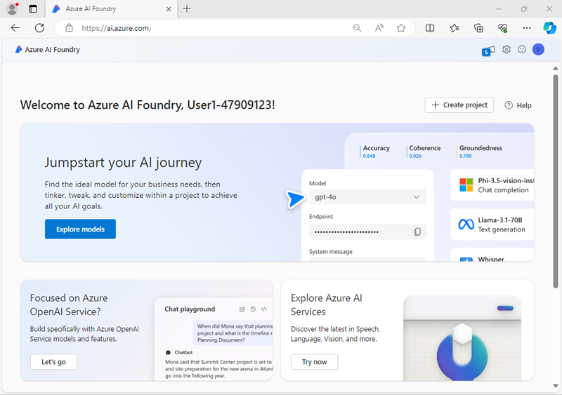
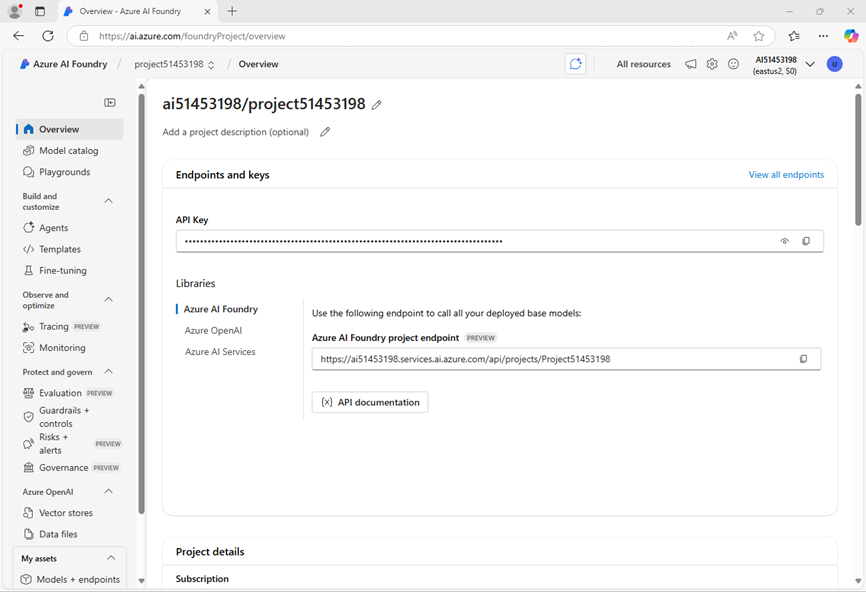

---
lab:
    title: 'Fine-tune a language model'
    description: 'Learn how to use your own training data to fine-tune a model and customize its behavior.'
---

# Fine-tune a language model

When you want a language model to behave a certain way, you can use prompt engineering to define the desired behavior. When you want to improve the consistency of the desired behavior, you can opt to fine-tune a model, comparing it to your prompt engineering approach to evaluate which method best fits your needs.

In this exercise, you'll fine-tune a language model with the Azure AI Foundry that you want to use for a custom chat application scenario. You'll compare the fine-tuned model with a base model to assess whether the fine-tuned model fits your needs better.

Imagine you work for a travel agency and you're developing a chat application to help people plan their vacations. The goal is to create a simple and inspiring chat that suggests destinations and activities with a consistent, friendly conversational tone.

This exercise will take approximately **60** minutes\*.

> \* **Note**: This timing is an estimate based on the average experience. Fine-tuning is dependent on cloud infrastructure resources, which can take a variable amount of time to provision depending on data center capacity and concurrent demand. Some activities in this exercise may take a <u>long</u> time to complete, and require patience. If things are taking a while, consider reviewing the [Azure AI Foundry fine-tuning documentation](https://learn.microsoft.com/azure/ai-studio/concepts/fine-tuning-overview) or taking a break. It is possible some processes may time-out or appear to run indefinitely. Some of the technologies used in this exercise are in preview or in active development. You may experience some unexpected behavior, warnings, or errors.

## Deploy a model in an Azure AI Foundry project

Let's start by deploying a model in an Azure AI Foundry project.

1. In a web browser, open the [Azure AI Foundry portal](https://ai.azure.com) at `https://ai.azure.com` and sign in using your Azure credentials. Close any tips or quick start panes that are opened the first time you sign in, and if necessary use the **Azure AI Foundry** logo at the top left to navigate to the home page, which looks similar to the following image (close the **Help** pane if it's open):

    

1. In the home page, in the **Explore models and capabilities** section, search for the `gpt-4o` model; which we'll use in our project.
1. In the search results, select the **gpt-4o** model to see its details, and then at the top of the page for the model, select **Use this model**.
1. When prompted to create a project, enter a valid name for your project and expand **Advanced options**.
1. Select **Customize** and specify the following settings for your project:
    - **Azure AI Foundry resource**: *A valid name for your Azure AI Foundry resource*
    - **Subscription**: *Your Azure subscription*
    - **Resource group**: *Create or select a resource group*
    - **Region**: *Select one of the following regions*:\*
        - East US 2
        - North Central US
        - Sweden Central

    > \* At the time of writing, these regions support fine-tuning for gpt-4o models.

1. Select **Create** and wait for your project to be created. If prompted, deploy the gpt-4o model using the **Global standard** deployment type and customize the deployment details to set a **Tokens per minute rate limit** of 50K (or the maximum available if less than 50K).

    > **Note**: Reducing the TPM helps avoid over-using the quota available in the subscription you are using. 50,000 TPM should be sufficient for the data used in this exercise. If your available quota is lower than this, you will be able to complete the exercise but you may experience errors if the rate limit is exceeded.

1. When your project is created, the chat playground will be opened automatically so you can test your model:
1. In the **Setup** pane, note the name of your model deployment; which should be **gpt-4o**. You can confirm this by viewing the deployment in the **Models and endpoints** page (just open that page in the navigation pane on the left).
1. In the navigation pane on the left, select **Overview** to see the main page for your project; which looks like this:

    

## Fine-tune a model

Because fine-tuning a model takes some time to complete, you'll start the fine-tuning job now and come back to it after exploring the base gpt-4o model you already deployed.

1. Download the [training dataset](https://raw.githubusercontent.com/MicrosoftLearning/mslearn-ai-studio/refs/heads/main/data/travel-finetune-hotel.jsonl) at `https://raw.githubusercontent.com/MicrosoftLearning/mslearn-ai-studio/refs/heads/main/data/travel-finetune-hotel.jsonl`and save it as a JSONL file locally.

    > **Note**: Your device might default to saving the file as a .txt file. Select all files and remove the .txt suffix to ensure you're saving the file as JSONL.

1. Navigate to the **Fine-tuning** page under the **Build and customize** section, using the menu on the left.
1. Select the button to add a new fine-tune model, select the **gpt-4o** model and then select **Next**.
1. **Fine-tune** the model using the following configuration:
    - **Method of customization**: Supervised
    - **Base model**: *Select the default version of **gpt-4o***
    - **Training data**: *Select the option to **Add training data** and upload and apply the .jsonl file you downloaded previously*
    - **Model suffix**: `ft-travel`
    - **Seed**: *Random
1. Submit the fine-tuning details, and the job will start. It may take some time to complete. You can continue with the next section of the exercise while you wait.

> **Note**: Fine-tuning and deployment can take a significant amount of time (30 minutes or longer), so you may need to check back periodically. You can see more details of the progress so far by selecting the fine-tuning model job and viewing its **Logs** tab.

## Chat with a base model

While you wait for the fine-tuning job to complete, let's chat with a base GPT 4o model to assess how it performs.

1. In the navigation pane on the left, select **Playgrounds** and open the **Chat playground**.
1. Verify your deployed **gpt-4o** base model is selected in setup pane.
1. In the chat window, enter the query `What can you do?` and view the response.

    The answers may be fairly generic. Remember we want to create a chat application that inspires people to travel.

1. Update the system message in the setup pane with the following prompt:

    ```
    You are an AI assistant that helps people plan their travel.
    ```

1. Select **Apply changes** to update the system message.
1. In the chat window, enter the query `What can you do?` again, and view the response.
1
    As a response, the assistant may tell you that it can help you book flights, hotels and rental cars for your trip. You want to avoid this behavior.

1. Update the system message again with a new prompt:

    ```
    You are an AI travel assistant that helps people plan their trips. Your objective is to offer support for travel-related inquiries, such as visa requirements, weather forecasts, local attractions, and cultural norms.
    You should not provide any hotel, flight, rental car or restaurant recommendations.
    Ask engaging questions to help someone plan their trip and think about what they want to do on their holiday.
    ```
.
1. Continue testing your chat application to verify it doesn't provide any information that isn't grounded in retrieved data. For example, ask the following questions and review the model's answers, paying particular attention to the tone and writing style that the model uses to respond:
   
    `Where in Rome should I stay?`
    
    `I'm mostly there for the food. Where should I stay to be within walking distance of affordable restaurants?`

    `What are some local delicacies I should try?`

    `When is the best time of year to visit in terms of the weather?`

    `What's the best way to get around the city?`

## Review the training file

The base model seems to work well enough, but you may be looking for a particular conversational style from your generative AI app. The training data used for fine-tuning offers you the chance to create explicit examples of the kinds of response you want.

1. Open the JSONL file you downloaded previously (you can open it in any text editor)
1. Examine the list of the JSON documents in the training data file. The first one should be similar to this (formatted for readability):

    ```json
    {"messages": [
        {"role": "system", "content": "You are an AI travel assistant that helps people plan their trips. Your objective is to offer support for travel-related inquiries, such as visa requirements, weather forecasts, local attractions, and cultural norms. You should not provide any hotel, flight, rental car or restaurant recommendations. Ask engaging questions to help someone plan their trip and think about what they want to do on their holiday."},
        {"role": "user", "content": "What's a must-see in Paris?"},
        {"role": "assistant", "content": "Oh la la! You simply must twirl around the Eiffel Tower and snap a chic selfie! After that, consider visiting the Louvre Museum to see the Mona Lisa and other masterpieces. What type of attractions are you most interested in?"}
        ]}
    ```

    Each example interaction in the list includes the same system message you tested with the base model, a user prompt related to a travel query, and a response. The style of the responses in the training data will help the fine-tuned model learn how it should respond.

## Deploy the fine-tuned model

When fine-tuning has successfully completed, you can deploy the fine-tuned model.

1. Navigate to the **Fine-tuning** page under **Build and customize** to find your fine-tuning job and its status. If it's still running, you can opt to continue chatting with your deployed base model or take a break. If it's completed, you can continue.

    > **Tip**: Use the **Refresh** button in the fine-tuning page to refresh the view. If the fine-tuning job disappears entirely, refresh the page in the browser.

1. Select the fine-tuning job link to open its details page. Then, select the **Metrics** tab and explore the fine-tune metrics.
1. Deploy the fine-tuned model with the following configurations:
    - **Deployment name**: *A valid name for your model deployment*
    - **Deployment type**: Standard
    - **Tokens per Minute Rate Limit (thousands)**: 50K *(or the maximum available in your subscription if less than 50K)*
    - **Content filter**: Default
1. Wait for the deployment to be complete before you can test it, this might take a while. Check the **Provisioning state** until it has succeeded (you may need to refresh the browser to see the updated status).

## Test the fine-tuned model

Now that you deployed your fine-tuned model, you can test it like you tested your deployed base model.

1. When the deployment is ready, navigate to the fine-tuned model and select **Open in playground**.
1. Ensure the system message includes these instructions:

    ```
    You are an AI travel assistant that helps people plan their trips. Your objective is to offer support for travel-related inquiries, such as visa requirements, weather forecasts, local attractions, and cultural norms.
    You should not provide any hotel, flight, rental car or restaurant recommendations.
    Ask engaging questions to help someone plan their trip and think about what they want to do on their holiday.
    ```

1. Test your fine-tuned model to assess whether its behavior is more consistent now. For example, ask the following questions again and explore the model's answers:

    `Where in Rome should I stay?`

    `I'm mostly there for the food. Where should I stay to be within walking distance of affordable restaurants?`

    `What are some local delicacies I should try?`

    `When is the best time of year to visit in terms of the weather?`

    `What's the best way to get around the city?`

1. After reviewing the responses, how do they compare to those of the base model?

## Clean up

If you've finished exploring Azure AI Foundry, you should delete the resources you've created to avoid unnecessary Azure costs.

- Navigate to the [Azure portal](https://portal.azure.com) at `https://portal.azure.com`.
- In the Azure portal, on the **Home** page, select **Resource groups**.
- Select the resource group that you created for this exercise.
- At the top of the **Overview** page for your resource group, select **Delete resource group**.
- Enter the resource group name to confirm you want to delete it, and select **Delete**.
