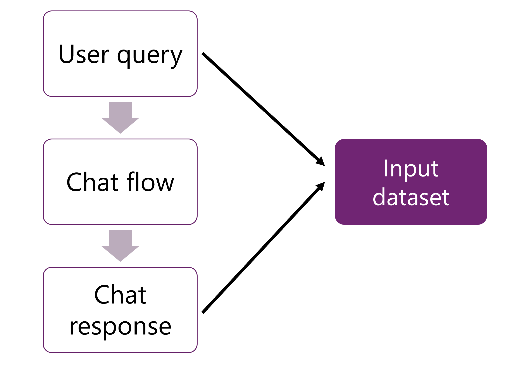

---
lab:
    title: 'Evaluate generative AI performance'
    description: 'Learn how to evaluate models and chat flows to optimize the performance of your chat app and its ability to respond appropriately.'
---

# Evaluate generative AI performance

In this exercise, you'll explore built-in and custom evaluations to assess and compare the performance of your AI applications with the Azure AI Foundry portal.

This exercise will take approximately **30** minutes.

## Create an AI hub and project in the Azure AI Foundry

You start by creating an Azure AI Foundry project within an Azure AI hub:

1. In a web browser, open [https://ai.azure.com](https://ai.azure.com) and sign in using your Azure credentials.
1. Select the **Home** page, then select **+ New project**.
1. In the **Create a project** wizard, give a unique name for your project then select **Customize** and set the following settings:
    - **Hub name**: *A unique name*
    - **Subscription**: *Your Azure subscription*
    - **Resource group**: *A new resource group*
    - **Location**: Select **Help me choose** and then select **gpt-4** in the Location helper window and use the recommended region\*
    - **Connect Azure AI Services or Azure OpenAI**: (New) *Autofills with your selected hub name*
    - **Connect Azure AI Search**: Skip connecting

    > \* Azure OpenAI resources are constrained at the tenant level by regional quotas. The listed regions in the location helper include default quota for the model type(s) used in this exercise. In the event of a quota limit being reached later in the exercise, there's a possibility you may need to create another resource in a different region. Learn more about [model availability per region](https://learn.microsoft.com/azure/ai-services/openai/concepts/models#availability)

1. Select **Next** and review your configuration.
1. Select **Create a project** and wait for the process to complete.

## Deploy a GPT model

To use a language model in prompt flow, you need to deploy a model first. The Azure AI Foundry portal allows you to deploy OpenAI models that you can use in your flows.

1. Navigate to the **Models + endpoints** page under the **My assets** section, using the menu on the left.
1. Select the **+ Deploy model** button, and select the **Deploy base model** option.
1. Create a new deployment of the **gpt-4** model with the following settings by selecting **Customize** in the **Deploy model** wizard:
    - **Deployment name**: *A unique name for your model deployment*
    - **Deployment type**: Standard
    - **Model version**: *Select the default version*
    - **AI resource**: *Select the resource created previously*
    - **Tokens per Minute Rate Limit (thousands)**: 5K
    - **Content filter**: DefaultV2
    - **Enable dynamic quota**: Disabled

    > **Note**: If your current AI resource location doesn't have quota available for the model you want to deploy, you will be asked to choose a different location where a new AI resource will be created and connected to your project.

1. Wait for the model to be deployed. When the deployment is ready, select **Open in playground**.
1. In the **Give the model instructions and context** text box, change the content to the following:

   ```
   **Objective**: Assist users with travel-related inquiries, offering tips, advice, and recommendations as a knowledgeable travel agent.

   **Capabilities**:
   - Provide up-to-date travel information, including destinations, accommodations, transportation, and local attractions.
   - Offer personalized travel suggestions based on user preferences, budget, and travel dates.
   - Share tips on packing, safety, and navigating travel disruptions.
   - Help with itinerary planning, including optimal routes and must-see landmarks.
   - Answer common travel questions and provide solutions to potential travel issues.
    
   **Instructions**:
   1. Engage with the user in a friendly and professional manner, as a travel agent would.
   2. Use available resources to provide accurate and relevant travel information.
   3. Tailor responses to the user's specific travel needs and interests.
   4. Ensure recommendations are practical and consider the user's safety and comfort.
   5. Encourage the user to ask follow-up questions for further assistance.
   ```

1. Select **Apply changes**.
1. In the chat (history) window, enter the query: `What can you do?` to verify that the language model is behaving as expected.

Now that you have a deployed model with an updated system message, you can evaluate the model.

## Manually evaluate a language model in the Azure AI Foundry portal

You can manually review model responses based on test data. Manually reviewing allows you to test different inputs one at a time to evaluate whether the model performs as expected.

1. In the **Chat playground**, select the **Evaluate**  dropdown from the top bar, and select **Manual evaluation**.
1. Change the **System message** to the same message as you used above (included here again):

   ```
   **Objective**: Assist users with travel-related inquiries, offering tips, advice, and recommendations as a knowledgeable travel agent.

   **Capabilities**:
   - Provide up-to-date travel information, including destinations, accommodations, transportation, and local attractions.
   - Offer personalized travel suggestions based on user preferences, budget, and travel dates.
   - Share tips on packing, safety, and navigating travel disruptions.
   - Help with itinerary planning, including optimal routes and must-see landmarks.
   - Answer common travel questions and provide solutions to potential travel issues.
    
   **Instructions**:
   1. Engage with the user in a friendly and professional manner, as a travel agent would.
   2. Use available resources to provide accurate and relevant travel information.
   3. Tailor responses to the user's specific travel needs and interests.
   4. Ensure recommendations are practical and consider the user's safety and comfort.
   5. Encourage the user to ask follow-up questions for further assistance.
   ```

1. In the **Manual evaluation result** section, you'll add five inputs for which you will review the output. Enter the following five questions as five separate **Inputs**:

   `Can you provide a list of the top-rated budget hotels in Rome?`

   `I'm looking for a vegan-friendly restaurant in New York City. Can you help?`

   `Can you suggest a 7-day itinerary for a family vacation in Orlando, Florida?`

   `Can you help me plan a surprise honeymoon trip to the Maldives?`

   `Are there any guided tours available for the Great Wall of China?`

1. Select **Run** from the top bar to generate outputs for all questions you added as inputs.
1. You can now manually review the outputs for each question by selecting the thumbs up or down icon at the bottom right of a response. Rate each response, ensuring you include at least one thumbs up and one thumbs down response in your ratings.
1. Select **Save results** from the top bar. Enter `manual_evaluation_results` as the name for the results.
1. Using the menu on the left, navigate to **Evaluation**.
1. Select the **Manual evaluations** tab to find the manual evaluations you just saved. Note that you can explore your previously created manual evaluations, continue where you left off, and save the updated evaluations.

## Evaluate your chat app with the built-in metrics

When you have created a chat application with prompt flow, you can evaluate the flow by doing a batch run and assessing the performance of the flow with built-in metrics.



To evaluate a chat flow, the user queries, and chat responses are provided as input for an evaluation.

To save time, we have created a batch output dataset for you that contains the results of multiple inputs being processed by a prompt flow. Each of the results are stored in the dataset you'll evaluate in the next step.

1. Select the **Automated evaluations** tab and create a **New evaluation** with the following settings:
    <details>  
      <summary><b>Troubleshooting tip</b>: Permissions error</summary>
        <p>If you receive a permissions error when you create a new prompt flow, try the following to troubleshoot:</p>
        <ul>
          <li>In the Azure portal, select the AI Services resource.</li>
          <li>On the Identity tab under Resource Management, confirm that it is system assigned managed identity.</li>
          <li>Navigate to the associated Storage Account. On the IAM page, add role assignment <em>Storage blob data reader</em>.</li>
          <li>Under <strong>Assign access to</strong>, choose <strong>Managed Identity</strong>, <strong>+ Select members</strong>, and select the <strong>All system-assigned managed identities</strong>.</li>
          <li>Review and assign to save the new settings and retry the previous step.</li>
        </ul>
    </details>

    - **What do you want to evaluate?**: Dataset
    - **Evaluation name**: *Enter a unique name*
    - Select **Next**
    - **Select the data you want to evaluate**: Add your dataset
        - Download the [validation dataset](https://raw.githubusercontent.com/MicrosoftLearning/mslearn-ai-studio/main/data/travel-qa.jsonl) at `https://raw.githubusercontent.com/MicrosoftLearning/mslearn-ai-studio/main/data/travel-qa.jsonl`, save it as a JSONL file and upload it to the UI.

    > **Note**: Your device might default to saving the file as a .txt file. Select all files and remove the .txt suffix to ensure you're saving the file as JSONL.

    - Select **Next**
    - **Select metrics**: Coherence, Fluency
    - **Connection**: *Your AI Services connection*
    - **Deployment name/Model**: *Your deployed GPT-4 model*
    - **query**: Select **query** as the data source
    - **response**: Select **response** as the data source
      
1. Select **Next** then review your data and **Submit** the new evaluation.
1. Wait for the evaluations to be completed, you may need to refresh.
1. Select the evaluation run you just created.
1. Explore the **Metric dashboard** and **Detailed metrics result**.

## Delete Azure resources

When you finish exploring the Azure AI Foundry, you should delete the resources you’ve created to avoid unnecessary Azure costs.

- Navigate to the [Azure portal](https://portal.azure.com) at `https://portal.azure.com`.
- In the Azure portal, on the **Home** page, select **Resource groups**.
- Select the resource group that you created for this exercise.
- At the top of the **Overview** page for your resource group, select **Delete resource group**.
- Enter the resource group name to confirm you want to delete it, and select **Delete**.
