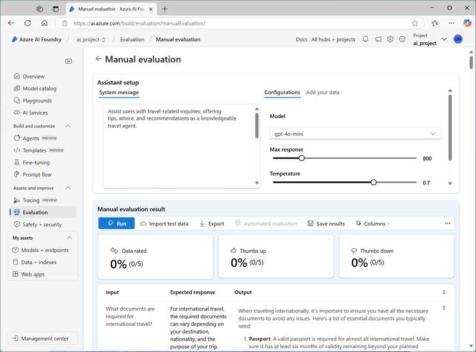
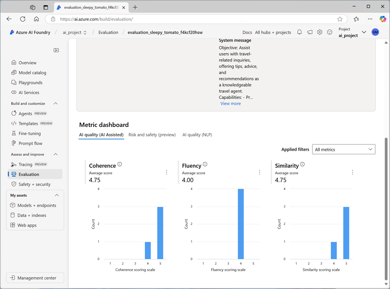

---
lab:
    title: 'Evaluate generative AI model performance'
    description: 'Learn how to evaluate models and prompts to optimize the performance of your chat app and its ability to respond appropriately.'
---

# Evaluate generative AI model performance

In this exercise, you'll use manual and automated evaluations to assess the performance of a model in the Azure AI Foundry portal.

This exercise will take approximately **30** minutes.

> **Note**: Some of the technologies used in this exercise are in preview or in active development. You may experience some unexpected behavior, warnings, or errors.

## Create an Azure AI Foundry hub and project

The features of Azure AI Foundry we're going to use in this exercise require a project that is based on an Azure AI Foundry *hub* resource.

1. In a web browser, open the [Azure AI Foundry portal](https://ai.azure.com) at `https://ai.azure.com` and sign in using your Azure credentials. Close any tips or quick start panes that are opened the first time you sign in, and if necessary use the **Azure AI Foundry** logo at the top left to navigate to the home page, which looks similar to the following image (close the **Help** pane if it's open):

    

1. In the browser, navigate to `https://ai.azure.com/managementCenter/allResources` and select **Create new**. Then choose the option to create a new **AI hub resource**.
1. In the **Create a project** wizard, enter a valid name for your project, and select the option to create a new hub. Then use the **Rename hub** link to specify a valid name for your new hub, expand **Advanced options**, and specify the following settings for your project:
    - **Subscription**: *Your Azure subscription*
    - **Resource group**: *Create or select a resource group*
    - **Region**:  Select one of the following locations (*In the event of a quota limit being exceeded later in the exercise, you may need to create another resource in a different region.*):
        - East US 2
        - France Central
        - UK South
        - Sweden Central

    > **Note**: If you're working in an Azure subscription in which policies are used to restrict allowable resource names, you may need to use the link at the bottom of the **Create a new project** dialog box to create the hub using the Azure portal.

    > **Tip**: If the **Create** button is still disabled, be sure to rename your hub to a unique alphanumeric value.

1. Wait for your project to be created.

## Deploy models

In this exercise, you'll evaluate the performance of a gpt-4o-mini model. You'll also use a gpt-4o model to generate AI-assisted evaluation metrics.

1. In the navigation pane on the left for your project, in the **My assets** section, select the **Models + endpoints** page.
1. In the **Models + endpoints** page, in the **Model deployments** tab, in the **+ Deploy model** menu, select **Deploy base model**.
1. Search for the **gpt-4o** model in the list, and then select and confirm it.
1. Deploy the model with the following settings by selecting **Customize** in the deployment details:
    - **Deployment name**: *A valid name for your model deployment*
    - **Deployment type**: Global Standard
    - **Automatic version update**: Enabled
    - **Model version**: *Select the most recent available version*
    - **Connected AI resource**: *Select your Azure OpenAI resource connection*
    - **Tokens per Minute Rate Limit (thousands)**: 50K *(or the maximum available in your subscription if less than 50K)*
    - **Content filter**: DefaultV2

    > **Note**: Reducing the TPM helps avoid over-using the quota available in the subscription you are using. 50,000 TPM should be sufficient for the data used in this exercise. If your available quota is lower than this, you will be able to complete the exercise but you may experience errors if the rate limit is exceeded.

1. Wait for the deployment to complete.
1. Return to the **Models + endpoints** page and repeat the previous steps to deploy a **gpt-4o-mini** model with the same settings.

## Manually evaluate a model

You can manually review model responses based on test data. Manually reviewing allows you to test different inputs to evaluate whether the model performs as expected.

1. In a new browser tab, download the [travel_evaluation_data.jsonl](https://raw.githubusercontent.com/MicrosoftLearning/mslearn-ai-studio/refs/heads/main/data/travel_evaluation_data.jsonl) from `https://raw.githubusercontent.com/MicrosoftLearning/mslearn-ai-studio/refs/heads/main/data/travel_evaluation_data.jsonl` and save it in a local folder as **travel_evaluation_data.jsonl** (be sure to save it as a .jsonl file, not a .txt file).
1. Back on the Azure AI Foundry portal tab, in the navigation pane, in the **Protect and govern** section, select **Evaluation**.
1. If the **Create a new evaluation** pane opens automatically, select **Cancel** to close it.
1. In the **Evaluation** page, view the **Manual evaluations** tab and select **+ New manual evaluation**.
1. In the **Configurations** section, in the **Model** list, select your **gpt-4o** model deployment.
1. Change the **System message** to the following instructions for an AI travel assistant:

   ```
   Assist users with travel-related inquiries, offering tips, advice, and recommendations as a knowledgeable travel agent.
   ```

1. In the **Manual evaluation result** section, select **Import test data** and upload the **travel_evaluation_data.jsonl** file you downloaded previously; scrolling down to map the dataset fields as follows:
    - **Input**: Question
    - **Expected response**: ExpectedResponse
1. Review the questions and expected answers in the test file - you'll use these to evaluate the responses that the model generates.
1. Select **Run** from the top bar to generate outputs for all questions you added as inputs. After a few minutes, the responses from the model should be shown in a new **Output** column, like this:

    

1. Review the outputs for each question, comparing the output from the model to the expected answer and "scoring" the results by selecting the thumbs up or down icon at the bottom right of each response.
1. After you've scored the responses, review the summary tiles above the list. Then in the toolbar, select **Save results** and assign a suitable name. Saving results enables you to retrieve them later for further evaluation or comparison with a different model.

## Use automated evaluation

While manually comparing model output to your own expected responses can be a useful way to assess a model's performance, it's a time-consuming approach in scenarios where you expect a wide range of questions and responses; and it provides little in the way of standardized metrics that you can use to compare different model and prompt combinations.

Automated evaluation is an approach that attempts to address these shortcomings by calculating metrics and using AI to assess responses for coherence, relevance, and other factors.

1. Use the back arrow (**&larr;**) next to the **Manual evaluation** page title to return to the **Evaluation** page.
1. View the **Automated evaluations** tab.
1. Select **Create a new evaluation**, and when prompted, select the option to evaluate a **Evaluate a model** and select **Next**.
1. On the **Select data source** page, select **Use your dataset** and select the **travel_evaluation_data_jsonl_*xxxx...*** dataset based on the file you uploaded previously, and select **Next**.
1. On the **Test your model** page, select the **gpt-4o-mini** model and change the **System message** to the same instructions for an AI travel assistant you used previously:

   ```
   Assist users with travel-related inquiries, offering tips, advice, and recommendations as a knowledgeable travel agent.
   ```

1. For the **query** field, select **\{\{item.question\}\}**.
1. Select **Next** to move to the next page.
1. On the **Configure evaluators** page, use the **+Add** button to add the following evaluators, configuring each one as follows:
    - **Model scorer**:
        - **Criteria name**: *Select the **Semantic_similarity** preset*
        - **Grade with**: *Select your **gpt-4o** model*
        - **User** settings (at the bottom):


            Output: \{\{sample.output_text\}\}<br>
            Ground Truth: \{\{item.ExpectedResponse\}\}<br>
            <br>
        
    - **Likert-scale evaluator**:
        - **Criteria name**: *Select the **Relevance** preset*
        - **Grade with**: *Select your **gpt-4o** model*
        - **Query**: \{\{item.question\}\}

    - **Text similarity**:
        - **Criteria name**: *Select the **F1_Score** preset*
        - **Ground truth**: \{\{item.ExpectedResponse\}\}

    - **Hateful and unfair content**:
        - **Criteria name**: Hate_and_unfairness
        - **Query**: \{\{item.question\}\}

1. Select **Next** and review your evaluation settings. You should have configured the evaluation to use the travel evaluation dataset to evaluate the **gpt-4o-mini** model for semantic similarity, relevance, F1 score, and hateful and unfair language.
1. Give the evaluation a suitable name, and **Submit** it to start the evaluation process, and wait for it to complete. It may take a few minutes. You can use the **Refresh** toolbar button to check the status.

1. When the evaluation has completed, scroll down if necessary to review the results.

    

1. At the top of the page, select the **Data** tab to see the raw data from the evaluation. The data includes the metrics for each input as well as explanations of the reasoning the gpt-4o model applied when assessing the responses.

## Clean up

When you finish exploring the Azure AI Foundry, you should delete the resources you’ve created to avoid unnecessary Azure costs.

- Navigate to the [Azure portal](https://portal.azure.com) at `https://portal.azure.com`.
- In the Azure portal, on the **Home** page, select **Resource groups**.
- Select the resource group that you created for this exercise.
- At the top of the **Overview** page for your resource group, select **Delete resource group**.
- Enter the resource group name to confirm you want to delete it, and select **Delete**.
