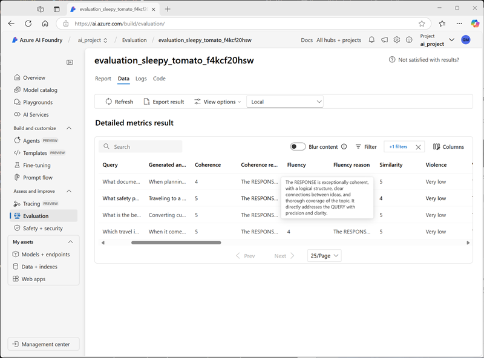

---
lab:
    title: 'Evaluate generative AI model performance'
    description: 'Learn how to evaluate models and prompts to optimize the performance of your chat app and its ability to respond appropriately.'
---

# Evaluate generative AI model performance

In this exercise, you'll use manual and automated evaluations to assess the performance of a model in the Azure AI Foundry portal.

This exercise will take approximately **30** minutes.

> **Note**: Some of the technologies used in this exercise are in preview or in active development. You may experience some unexpected behavior, warnings, or errors.

## Create an Azure AI Foundry project

Let's start by creating an Azure AI Foundry project.

1. In a web browser, open the [Azure AI Foundry portal](https://ai.azure.com) at `https://ai.azure.com` and sign in using your Azure credentials. Close any tips or quick start panes that are opened the first time you sign in, and if necessary use the **Azure AI Foundry** logo at the top left to navigate to the home page, which looks similar to the following image (close the **Help** pane if it is open):

    

1. In the home page, select **+ Create project**.
1. In the **Create a project** wizard, enter a valid name for your project and if an existing hub is suggested, choose the option to create a new one. Then review the Azure resources that will be automatically created to support your hub and project.
1. Select **Customize** and specify the following settings for your hub:
    - **Hub name**: *A valid name for your hub*
    - **Subscription**: *Your Azure subscription*
    - **Resource group**: *Create or select a resource group*
    - **Location**: Select one of the following regions\*
        - East US 2
        - France Central
        - UK South
        - Sweden Central
    - **Connect Azure AI Services or Azure OpenAI**: *Create a new AI Services resource*
    - **Connect Azure AI Search**: Skip connecting

    > \* At the time of writing, these regions support the evaluation of AI safety metrics. Model availability is constrained by regional quotas. In the event of a quota limit being reached later in the exercise, there's a possibility you may need to create another project in a different region.

1. Select **Next** and review your configuration. Then select **Create** and wait for the process to complete.
1. When your project is created, close any tips that are displayed and review the project page in Azure AI Foundry portal, which should look similar to the following image:

    

## Deploy models

In this exercise, you'll evaluate the performance of a gpt-4o-mini model. You'll also use a gpt-4o model to generate AI-assisted evaluation metrics.

1. In the navigation pane on the left for your project, in the **My assets** section, select the **Models + endpoints** page.
1. In the **Models + endpoints** page, in the **Model deployments** tab, in the **+ Deploy model** menu, select **Deploy base model**.
1. Search for the **gpt-4o** model in the list, and then select and confirm it.
1. Deploy the model with the following settings by selecting **Customize** in the deployment details:
    - **Deployment name**: *A valid name for your model deployment*
    - **Deployment type**: Global Standard
    - **Automatic version update**: Enabled
    - **Model version**: *Select the most recent available version*
    - **Connected AI resource**: *Select your Azure OpenAI resource connection*
    - **Tokens per Minute Rate Limit (thousands)**: 50K *(or the maximum available in your subscription if less than 50K)*
    - **Content filter**: DefaultV2

    > **Note**: Reducing the TPM helps avoid over-using the quota available in the subscription you are using. 50,000 TPM should be sufficient for the data used in this exercise. If your available quota is lower than this, you will be able to complete the exercise but you may experience errors if the rate limit is exceeded.

1. Wait for the deployment to complete.
1. Return to the **Models + endpoints** page and repeat the previous steps to deploy a **gpt-4o-mini** model with the same settings.

## Manually evaluate a model

You can manually review model responses based on test data. Manually reviewing allows you to test different inputs to evaluate whether the model performs as expected.

1. In a new browser tab, download the [travel_evaluation_data.csv](https://raw.githubusercontent.com/MicrosoftLearning/mslearn-ai-studio/refs/heads/main/data/travel_evaluation_data.csv) from `https://raw.githubusercontent.com/MicrosoftLearning/mslearn-ai-studio/refs/heads/main/data/travel_evaluation_data.csv` and save it in a local folder.
1. Back on the Azure AI Foundry portal tab, in the navigation pane, in the **Assess and improve** section, select **Evaluation**.
1. In the **Evaluation** page, view the **Manual evaluations** tab and select **+ New manual evaluation**.
1. Change the **System message** to the following instructions for an AI travel assistant:

   ```
   Objective: Assist users with travel-related inquiries, offering tips, advice, and recommendations as a knowledgeable travel agent.

   Capabilities:
   - Provide up-to-date travel information, including destinations, accommodations, transportation, and local attractions.
   - Offer personalized travel suggestions based on user preferences, budget, and travel dates.
   - Share tips on packing, safety, and navigating travel disruptions.
   - Help with itinerary planning, including optimal routes and must-see landmarks.
   - Answer common travel questions and provide solutions to potential travel issues.
    
   Instructions:
   1. Engage with the user in a friendly and professional manner, as a travel agent would.
   2. Use available resources to provide accurate and relevant travel information.
   3. Tailor responses to the user's specific travel needs and interests.
   4. Ensure recommendations are practical and consider the user's safety and comfort.
   5. Encourage the user to ask follow-up questions for further assistance.
   ```

1. In the **Configurations** section, in the **Model** list, select your **gpt-4o-mini** model deployment.
1. In the **Manual evaluation result** section, select **Import test data** and upload the **travel_evaluation_data.csv** file you downloaded previously; mapping the dataset fields as follows:
    - **Input**: Question
    - **Expected response**: ExpectedResponse
1. Review the questions and expected answers in the test file - you'll use these to evaluate the responses that the model generates.
1. Select **Run** from the top bar to generate outputs for all questions you added as inputs. After a few minutes, the responses from the model should be shown in a new **Output** column, like this:

    

1. Review the outputs for each question, comparing the output from the model to the expected answer and "scoring" the results by selecting the thumbs up or down icon at the bottom right of each response.
1. After you've scored the responses, review the summary tiles above the list. Then in the toolbar, select **Save results** and assign a suitable name. Saving results enables you to retrieve them later for further evaluation or comparison with a different model.

## Use automated evaluation

While manually comparing model output to your own expected responses can be a useful way to assess a model's performance, it's a time-consuming approach in scenarios where you expect a wide range of questions and responses; and it provides little in the way of standardized metrics that you can use to compare different model and prompt combinations.

Automated evaluation is an approach that attempts to address these shortcomings by calculating metrics and using AI to assess responses for coherence, relevance, and other factors.

1. Use the back arrow (**&larr;**) next to the **Manual evaluation** page title to return to the **Evaluation** page.
1. View the **Automated evaluations** tab.
1. Select **Create a new evaluation**, and when prompted, select the option to evaluate a **Model and prompt**
1. In the **Create a new evaluation** page, in the **Basic information** section, review the default auto-generated evaluation name (you can change this if you like) and select your **gpt-40-mini** model deployment.
1. Change the **System message** to the same instructions for an AI travel assistant you used previously:

   ```
   Objective: Assist users with travel-related inquiries, offering tips, advice, and recommendations as a knowledgeable travel agent.

   Capabilities:
   - Provide up-to-date travel information, including destinations, accommodations, transportation, and local attractions.
   - Offer personalized travel suggestions based on user preferences, budget, and travel dates.
   - Share tips on packing, safety, and navigating travel disruptions.
   - Help with itinerary planning, including optimal routes and must-see landmarks.
   - Answer common travel questions and provide solutions to potential travel issues.
    
   Instructions:
   1. Engage with the user in a friendly and professional manner, as a travel agent would.
   2. Use available resources to provide accurate and relevant travel information.
   3. Tailor responses to the user's specific travel needs and interests.
   4. Ensure recommendations are practical and consider the user's safety and comfort.
   5. Encourage the user to ask follow-up questions for further assistance.
   ```

1. In the **Configure test data** section, note that you can use a GPT model to generate test data for you (which you could then edit and supplement to match your own expectations), use an existing dataset, or upload a file. In this exercise, select **Use existing dataset** and then select the **travel_evaluation_data_csv_*xxxx...*** dataset (which was created when you uploaded the .csv file previously).
1. Review the sample rows from the dataset, and then in the **Choose your data column** section, select the following column mappings:
    - **Query**: Question
    - **Context**: *Leave this blank. It's used to evaluate "groundedness" when  associating a contextual data source with your model.*
    - **Ground truth**: ExpectedAnswer
1. In the **Choose what you'd like to evaluate** section, select <u>all</u> of the following evaluation categories:
    - AI Quality (AI assisted)
    - Risk and safety (AI assisted)
    - AI quality (NLP)
1. In the **Choose a model deployment as judge** list, select your **gpt-4o** model. This model will be used to assess the responses from the ***gpt-4o-mini** model for language-related quality and standard generative AI comparison metrics.
1. Select **Create** to start the evaluation process, and wait for it to complete. It may take a few minutes.

    > **Tip**: If an error indicating that project permissions are being set is dispayed, wait a minute and then select **Create** again. It can take some time for resource permissions for a newly created project to propagate.

1. When the evaluation has completed, scroll down if necessary to see the **Metric dashboard** area and view the **AI quality (AI Assisted)** metrics:

    

    Use the **<sup>(i) </sup>** icons to view the metric definitions.

1. View the **Risk and safety** tab to see the metrics associated with potentially harmful content.
1. View the **AI quality (NLP**) tab to see standard metrics for generative AI models.
1. Scroll back to the top of the page if necessary, and select the **Data** tab to see the raw data from the evaluation. The data includes the metrics for each input as well as explanations of the reasoning the gpt-4o model applied when assessing the responses.

    

## Clean up

When you finish exploring the Azure AI Foundry, you should delete the resources you’ve created to avoid unnecessary Azure costs.

- Navigate to the [Azure portal](https://portal.azure.com) at `https://portal.azure.com`.
- In the Azure portal, on the **Home** page, select **Resource groups**.
- Select the resource group that you created for this exercise.
- At the top of the **Overview** page for your resource group, select **Delete resource group**.
- Enter the resource group name to confirm you want to delete it, and select **Delete**.
