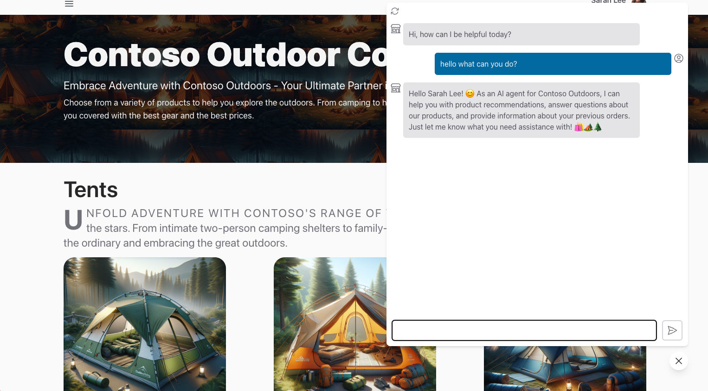
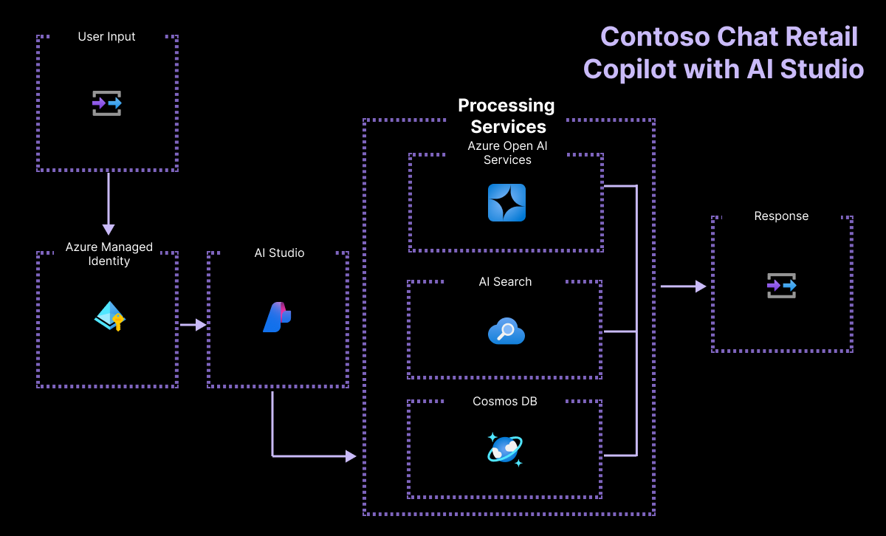
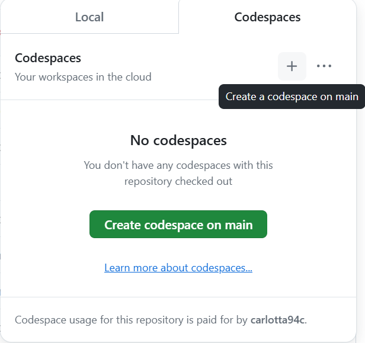
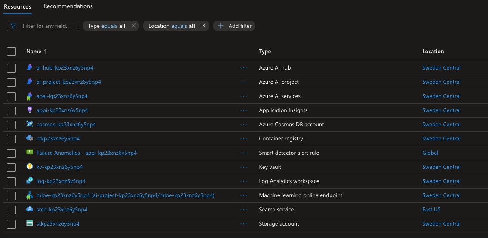
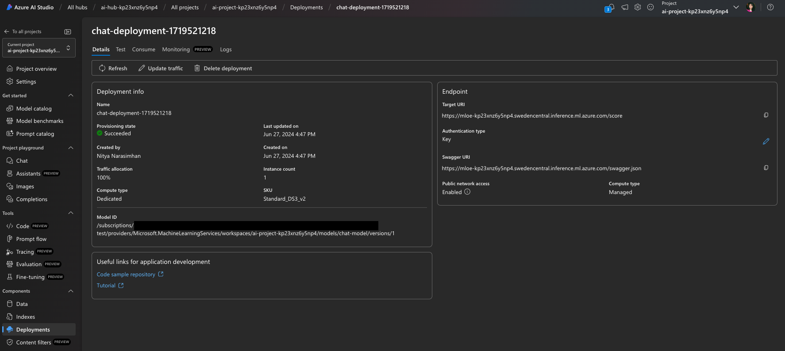
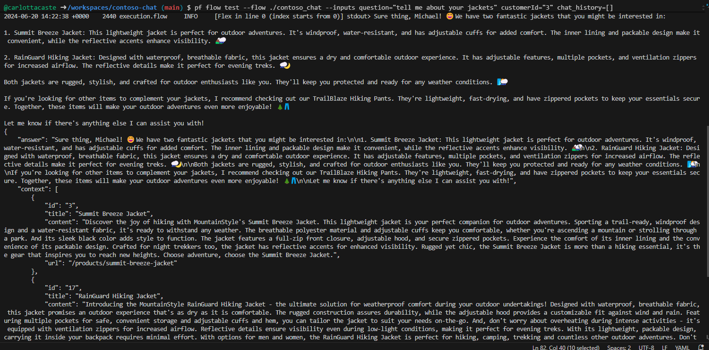
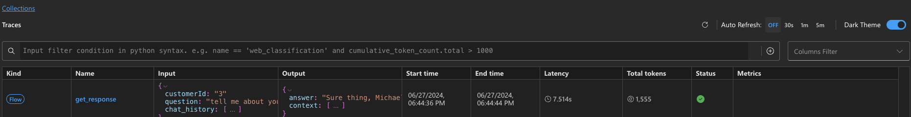
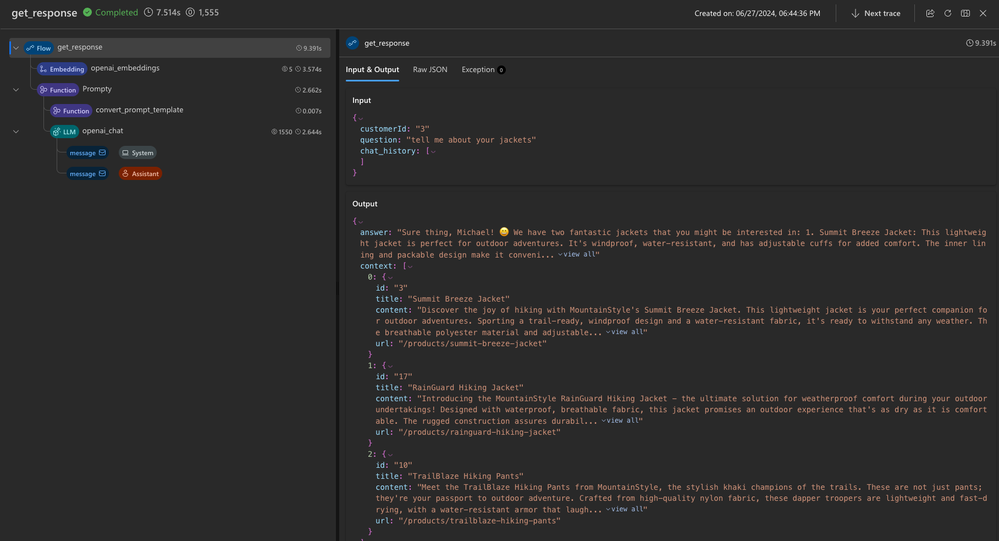

# Build a generative AI app using code-first development tools

In this exercise, you'll clone and deploy an Azure Developer CLI template that provisions and [deploys your AI project to an online endpoint](https://learn.microsoft.com/azure/developer/azure-developer-cli/azure-ai-ml-endpoints?WT.mc_id=academic-140829-cacaste) on Azure AI Foundry. You'll then use it as a starting point to build your own custom copilot with Azure AI and a code-first experience.

This exercise will take approximately **90** minutes.

## Before you start

To complete this exercise, you'll need:

- A GitHub account to fork the project repository and test it in a GitHub Codespaces environment. Create a free account [on GitHub](https://github.com/).
- The basic tier of Azure AI Search to activate Semantic Ranker. Learn more about the [pricing details of AI Search](https://azure.microsoft.com/pricing/details/search/).
- To deploy three OpenAI models (`gpt-35-turbo`, `gpt-4`, `text-embedding-ada-002`). To be able to deploy the models, you need to create the AI hub in a region with sufficient quota. Learn more about [model region availability](https://learn.microsoft.com/azure/ai-services/openai/concepts/models?WT.mc_id=academic-140829-cacaste#model-summary-table-and-region-availability).

## Understand the scenario

To get started with the Azure Developer CLI AI project template, navigate to the [Azure AI Templates with Azure Developer CLI collection](https://learn.microsoft.com/collections/5pq0uompdgje8d/?WT.mc_id=academic-140829-cacaste). By exploring the collection, you can find several projects grouped by technology and use case, including multi-modal and multi-agent projects samples, copilot-like projects and samples integrating different frameworks and Azure services.

For this exercise, you'll take the **[Contoso Chat Retail copilot with Azure AI Foundry & PromptFlow (Python)](https://aka.ms/contoso-retail-sample)** project template as your starting point. This project template is a code-first experience that uses Prompty and PromptFlow to build a custom copilot (chat AI) that can be integrated into the retail  website (chat UI) of a fictional company called Contoso Outdoors.



The retail copilot solution uses a Retrieval Augmented Generation (RAG) pattern to ground responses in the company's product and customer data. Customers can ask the retail chatbot questions about the company's product catalog, and also get recommendations based on their prior purchases.

By selecting the project link included in the collection, you'll be redirected to the GitHub repository hosting the template code. The [README.md](https://github.com/Azure-Samples/contoso-chat/blob/main/README.md) file in the repository provides a detailed description of the project, including the architecture, the prerequisites, and the steps to deploy the project.



## Set up GitHub Codespaces

In this exercise you'll use [GitHub Codespaces](https://github.com/features/codespaces), a GitHub feature that lets you launch a pre-configured cloud-hosted [development container](https://docs.github.com/codespaces/setting-up-your-project-for-codespaces/adding-a-dev-container-configuration/introduction-to-dev-containers) directly from your repository, with one click. This way, you can quickly start coding without having to set up your local development environment, since the Codespaces already has all necessary tools and dependencies pre-installed.

To initialize your development environment, follow the steps below:

1. Navigate to the **contoso-chat** repository: `https://github.com/Azure-Samples/contoso-chat`
1. Select the **Fork** button in the top right corner of the contoso-chat GitHub repository page to create a copy of the repository in your GitHub account.
1. Once you have your forked repository, select the **Code** button and select **Codespaces**.
1. Select the **+** button to create a new codespace on the main branch of your forked repository.

    

1. In a few seconds, you're redirected to a new browser tab where the Codespaces environment is setup with an [attached Visual Studio Code editor](https://code.visualstudio.com/docs/devcontainers/containers) by default.

## Connect VS Code environment to Azure

The next step is connecting your development environment with the Azure subscription where you'd like to deploy the project. Start by opening a new terminal in your VS Code environment running in Codespaces.

1. First, verify that the [latest version](https://github.com/Azure/azure-dev/releases/tag/azure-dev-cli_1.9.3) of Azure Developer CLI is installed.
    ```bash
    azd version
    ```

1. Next, sign in into your Azure Account from the VS Code terminal.

    ```bash
    azd auth login 
    ```

## Provision Azure resources for your project

Once you are logged in, you are ready to start provisioning the Azure resources for the project in your subscription. You can do that in the same VS Code terminal you used for login.

1. Provision *and deploy* your AI application using azd.

    ```bash
    azd up
    ```

1. You should see the following prompts. Respond using the guidance below:
    - **Enter a new environment name:** *Used to create your resource group name*.
    - **Select an Azure Subscription to use**: *Select a subscription that has access to Azure OpenAI models*.
    - **Select an Azure location to use**: *Select a location with model quota available*.

    > Use the [model summary table and region availability](https://learn.microsoft.com/en-us/azure/ai-services/openai/concepts/models?WT.mc_id=academic-140829-cacaste#model-summary-table-and-region-availability) to find the region you need. For example, you can use `sweden central` as the Azure location since it is the region where the majority of the Azure OpenAI models are available.

## Validate provisioning by using Azure Portal

Provisioning and deploying an AI application using azd can take 10 minutes or more to complete. You can track progress by:

- Viewing detailed progress in the [Azure Portal](https://ms.portal.azure.com/). Search for the resource group corresponding to your environment name. Select the **Deployments** option in the sidebar, then monitor the deployment status of the resources being created.
- Visiting the [Azure AI Foundry portal](https://ai.azure.com) portal. Sign in using your Azure account. Search for the AI hub corresponding to the resource group above (you may need to refresh a few times). Select the listed AI project, then select **Deployments** in its sidebar to track status for models and chat application deployments.

Let's explore how to validate the provisioning of resources using the Azure Portal.

1. Navigate to the [Azure Portal](https://ms.portal.azure.com/) in the browser.
1. Sign in and find the resource group corresponding to the subscription and environment name you entered earlier. The **Overview** panel should look like this:

    

1. Let's start by verifying that the key [Azure AI Foundry architecture](https://learn.microsoft.com/azure/ai-studio/concepts/architecture) resources were created. The figure below provides more details on what each of these resources provides to our AI application.

    - **Azure AI hub**: Top-level Azure resource. Provides a collaboration environment for teams.
    - **Azure AI project**: Child of hub. Groups app components for orchestration, customization.
    - **Azure AI services**: Manages your model endpoints.

    

1. Next, let's verify that we provisioned two key resources for implementing our [Retrieval Augmented Generation](https://learn.microsoft.com/azure/ai-studio/concepts/retrieval-augmented-generation) design pattern by storing the product and customer data for query-driven retrieval.

    - **Search service**: To manage search indexes for our product catalog data.
    - **Azure Cosmos DB account**: To create a database for our customer order data.

1. Next, we can validate that we have supporting resources for managing our AI application needs:

    - **Application Insights**: To support monitoring and telemetry for the deployed application.
    - **Container Registry**: To store and manage Docker images used in the project, privately.
    - **Key vault**: To store project secrets (keys, credentials) securely.
    - **Storage account**: To store data related to AI project management (including logs).
    - **Smart detector alert rule**: Application Insights anomaly detector (for requests).

1. Last but not least, you'll notice a new resource with type **Machine learning online deployment**. This is the resource corresponding to our deployed Azure AI project endpoint (for the chat copilot).

## Validate deployment using the Azure AI Foundry

The Azure Portal helps you manage the underlying Azure resources for your project. The Azure AI Foundry portal helps you *build and manage* the AI projects themselves, end-to-end, from model selection to application deployment. The `azd up` command should have completed the entire process from provisioning required models, to deploying and hosting the copilot API endpoint for usage. Let's validate that the application is functioning as expected.

1. Visit the **Manage** page in the [Azure AI Foundry portal](https://ai.azure.com/manage) to view all Azure AI hubs in your subscription.
1. Select the hub for your resource group to view all Azure AI projects within it.
1. Select the default AI project in hub, then select **Deployments** in the menu on the left.
1. Under **Model deployments**, verify that you have an Azure OpenAI Connection including the deployments of:
    - **gpt-35-turbo**: Used for chat completion, forming the core chat engine.
    - **gpt-4**:  Used for chat evaluation, specifically AI-assisted flows.
    - **text-embedding-ada-002**: Used for query vectorization & search.
1. Verify that you have an machine learning online endpoint with:
    - **chat-model**: Chat AI deployment with *mloe-xxx* endpoint resource.

    

## Test the deployment (in the cloud) using Azure AI Foundry

To validate that the deployed copilot works, use the built-in test playground capability in the Azure AI Foundry portal.



1. In the Azure AI Foundry portal, from the **App deployments** list, select the **chat-deployment-xxxx** deployment.
1. On the **Details** page of the deployed chat application, select the **Test** tab to get the test interface.

    Note that the **Details** tab also has `Target URI` and `Key` values that you can use with other front-end applications (for example the Contoso Outdoor website) to integrate this chat assistant for real-world user interactions.

1. For now, test the copilot deployment with the following test **Input**:

    ```bash
    {"question": "tell me about your hiking shoes", "customerId": "2", "chat_history": []}
    ```

You should get a valid JSON response in the output component as shown.


## Test the deployment (locally) using Visual Studio Code

The **azd up** command not only provisions and deploys the application to Azure, it also *configures your local environment* in Visual Studio Code to support local development, testing, and iteration. Let's check this out.

1. First, validate that your VS Code environment was setup correctly. Search for a **config.json** file in the root folder and verify that it has the three properties defined below, with valid values.

    ```json
    {
        "subscription_id": "xxxxxxxxxxxxxxxx",
        "resource_group": "rg-xxxxxx",
        "workspace_name": "ai-project-xxxxxxx"
    }

    ```

1. Verify that a **.env** file was created in your root folder. It should contain a list of environment variables *with values filled in*.

    ```bash
    AZUREAI_HUB_NAME=
    AZUREAI_PROJECT_NAME=
    AZURE_CONTAINER_REGISTRY_ENDPOINT=
    AZURE_CONTAINER_REGISTRY_NAME=
    AZURE_COSMOS_NAME=
    AZURE_ENV_NAME=
    AZURE_KEY_VAULT_ENDPOINT=
    AZURE_KEY_VAULT_NAME=
    AZURE_LOCATION=
    AZURE_OPENAI_API_VERSION=
    AZURE_OPENAI_CHAT_DEPLOYMENT=
    AZURE_OPENAI_ENDPOINT=
    AZURE_OPENAI_NAME=
    AZURE_RESOURCE_GROUP=
    AZURE_SEARCH_ENDPOINT=
    AZURE_SEARCH_NAME=
    AZURE_SUBSCRIPTION_ID=
    AZURE_TENANT_ID=
    COSMOS_ENDPOINT=
    ```

1. Verify that you have the **Promptflow tools** installed in your development environment.

    ```bash
    pf version
    ```

1. Use the **pf flow test** tool to test the **contoso_chat** flex flow application locally, with the sample question below. Note the syntax of the command for passing the inputs:

    ```bash
    pf flow test --flow ./contoso_chat --inputs question="tell me about your jackets" customerId="3" chat_history=[]
    ```

You should receive a response like this:



### View traces (locally) using Visual Studio Code

1. You can trace the details of your execution with the `--ui` flag as shown below.

    ```bash
    pf flow test --flow ./contoso_chat --inputs question="tell me about your jackets" customerId="3" chat_history=[] --ui
    ```

This command should launch a **trace view** in your browser (in a new tab) with a table that provides high-level details about that test run including the latency and tokens usage.



1. Select the record to expand into a more detail trace view that lets you inspect the finer details of the flow - from the raw data (input, output) to the individual steps of the flow and the relevant components (for example, the prompt templates used for LLM).



## Understand the Contoso Chat codebase

Your Azure backend is provisioned and ready. Your local development environment is setup and configured to work with your Azure backend. Now, all you need to do is start modifying the contents to customize and redeploy your own version of the application. Let's take a quick look at how the codebase is structured.

> This is a **simplified listing** of the repository, eliminating some files and folders for clarity.

```bash
data/
    customer_info/  
        create-cosmos-db.ipynb      # Run notebook to upload data to Cosmos DB
        customer_info_1.json        # Example Customer info and orders file
        customer_info_2.json 
        ...
        ...
    product_info/   
        create-azure-search.ipynb   # Run notebook to index product data in AI Search
        products.csv                # Example Products data file

contoso_chat/                       # Main folder for application content
    ai_search.py                    # Search retrieval tool (for RAG design)
    chat.json                       # Example chat file (for Prompty template)
    chat.prompty                    # Chat asset (using Prompty format)
    chat_request.py                 # LLM request tool (for chat completion)
    flow.flex.yaml                  # Promptflow flex flow (define entry point)
    requirements.txt                # App dependencies (define runtime environment)

azure.yaml                          # Main configuration file for Azure Developer CLI  
infra/      
    ai.yaml                         # Define AI model deployments
    app/                            # Infrastructure-as-code config specific to app
    core/                           # Infrastructure-as-code config for core resources
    hooks/                          # Contains post-provisioning scripts
    main.bicep                      # Entry point for Bicep template used by azd
deployment/                         # ai.endpoint config files (named in azure.yaml)
    chat-deployment.yaml 
    chat-model.yaml  
    environment.yaml  

requirements.txt
```

When you want to customize the code:

- If you make app changes (in `contoso_chat/`) simply run `azd deploy` to redeploy the application to the previously provisioned backend. No additional re-provisioning or manual intervention steps required.
- If you make resource changes (in `infra/` folder) then run `azd up` to re-provision and redeploy the application. It should automatically pick up your prior configuration values from `.azure/` and modify them.

## Optional: Customize and redeploy the copilot

It's time to build your own custom copilot. Here are some things you can explore, to try this out.

Remember for each of these options:

- Use `azd deploy` to redeploy your application if you changed only the app code.
- Use `azd up` to re-provision and redeploy application if you changed resource configuration.

### Customize the customer and order history data

1. Review the sample data under **data/customer_info** for a sense of the default schema.
1. Explore the **data/create-cosmos-db.ipynb** notebook for a code-first approach to data updates.
1. **Modify** the sample data and **run** the notebook to change the default Azure CosmosDB database.
1. **Redeploy** the app. Try a test question to validate that new customer data is returned.

### Customize the product catalog data

1. Review the sample data under **data/product_info/** for a sense of the default schema.
1. Explore the **create-azure-search.ipynb** notebook for a code-first approach to index updates.
1. **Modify** the sample data and **run** the notebook to change the default Azure AI Search indexes.
1. **Redeploy** the app. Try a test question to validate that new product data is returned.

### Customize the prompt template

1. Review the **contoso_chat/chat.prompty** file for a sense of the default prompt template.
1. Review the **contoso_chat/chat.json** to understand the sample data schema for testing.
1. **Modify** the template (system message, safety, documentation or instructions).
1. **Modify** the example data if needed.
1. **Use** the Promptflow CLI to test the flow locally with the new prompt template.
1. **Install and use** the Prompty extension to create a new prompt template from scratch.

### Explore evaluation and pipeline automation

Replace the test dataset used to run the app evaluation pipeline through GitHub Actions with your own data. The test dataset is located in the **data** folder of the project, and it is in a **.jsonl** format.

1. Replace the test dataset file with your own data.
1. Then, run the evaluation pipeline by pushing the changes to the main branch of your forked repository.

    The evaluation pipeline will run automatically, and you can check the results in the GitHub Actions tab of your repository.

1. You can customize the evaluation pipeline by modifying the **evaluate.yaml** file in the **.github/workflows** folder of the project and the **evaluations_chat.py** script in the **evaluations** folder.

## Clean up and delete Azure resources

This project uses models and services (for example Azure AI Search) that can incur non-trivial costs if left running long-term. When you finish exploring this Azure AI AZD template, you should delete the resources you’ve created to avoid unnecessary Azure costs. You can do this by running the following command in the VS Code terminal:

```bash
azd down
```

This not only reverses the steps taken to provision and deploy the application, it also takes additional steps to *purge* resources that may otherwise be held in "soft delete" state, impacting your ability to reuse resource names or reclaim model quota. **This command will prompt you about these actions during the shutdown - so make sure you respond correctly**.
