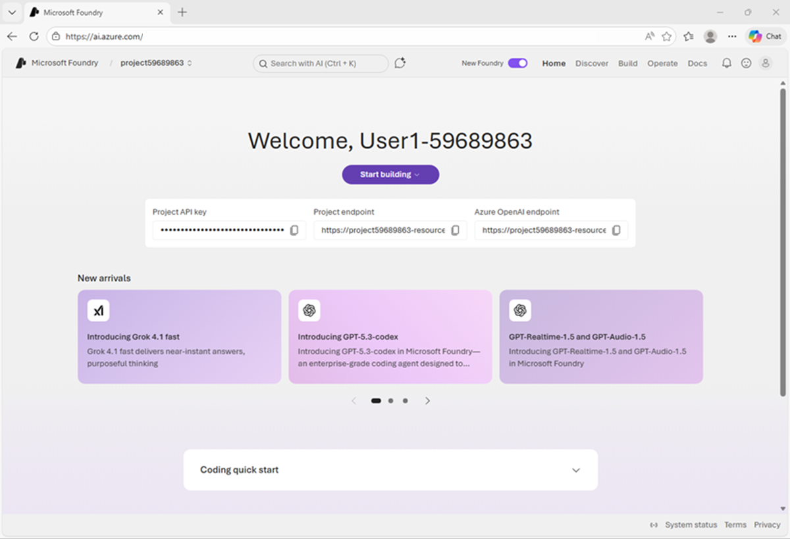
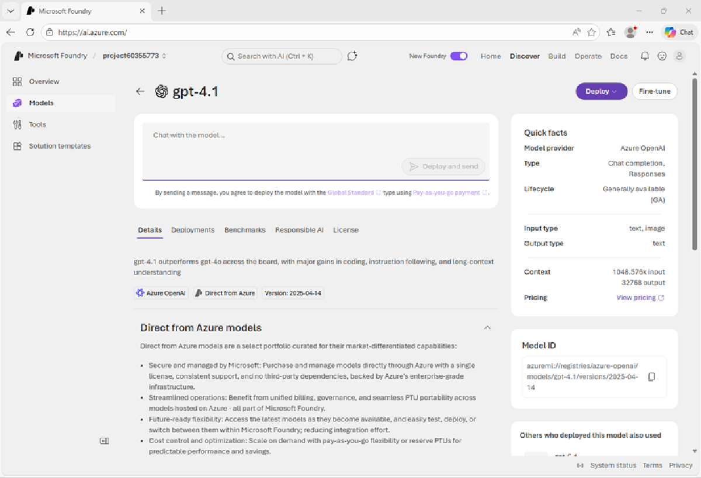
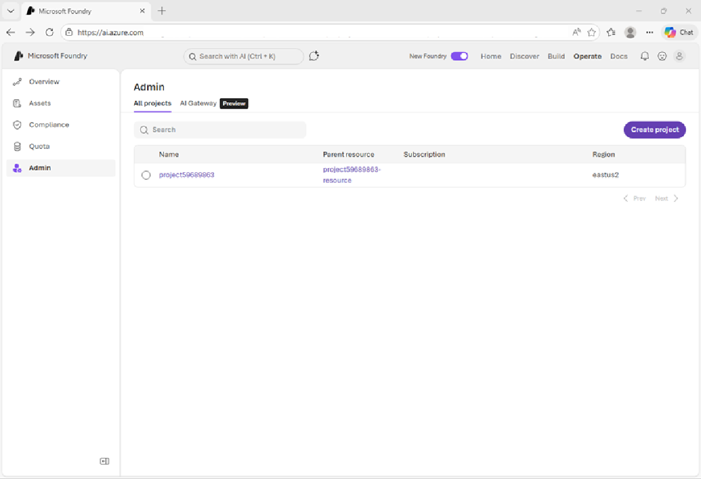
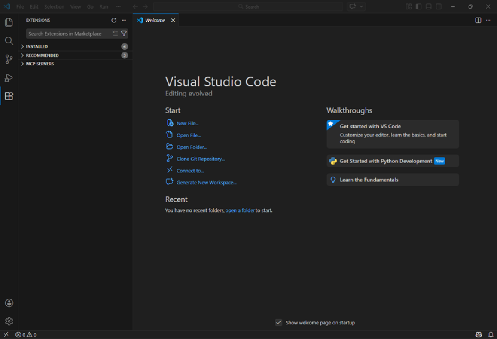
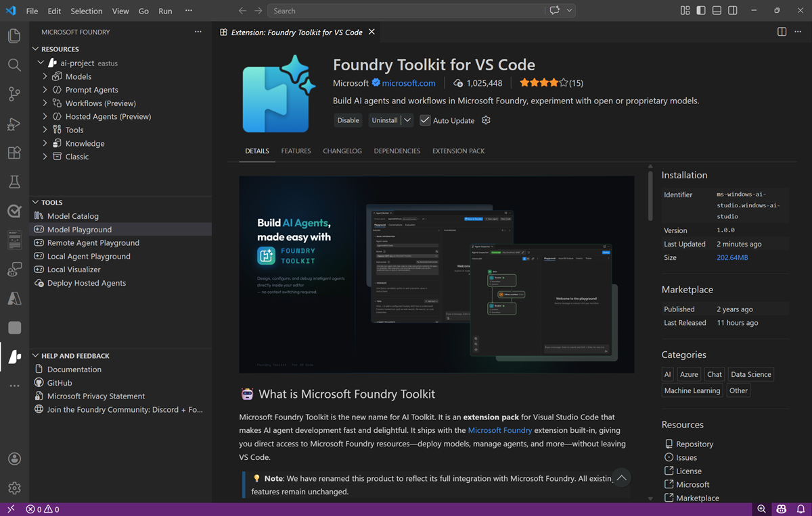
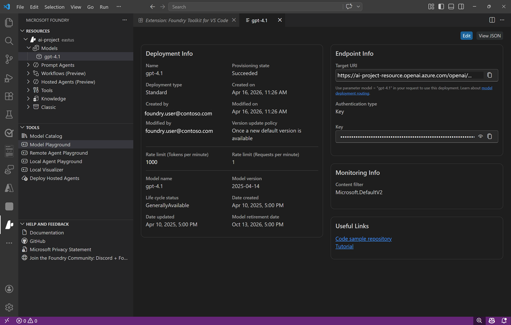
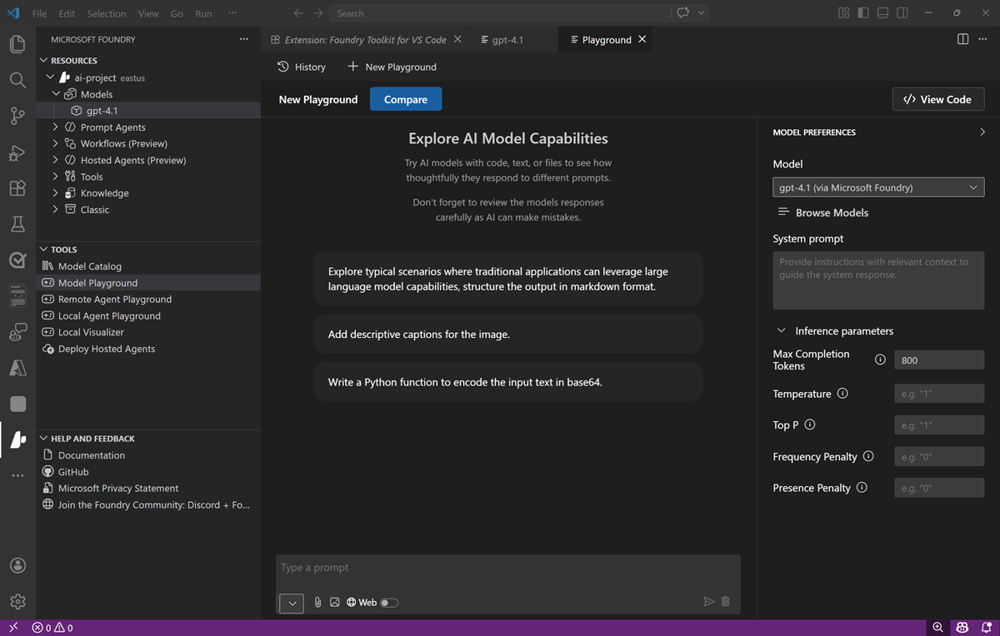

---
lab:
    title: 'Prepare for an AI development project'
    description: 'Learn how to organize AI resources in a Microsoft Foundry project and get started with the Visual Studio Code extension for Foundry.'
    level: 200
    duration: 30
---

# Prepare for an AI development project

In this exercise, you use Microsoft Foundry portal to create a project, ready to build an AI solution.

This exercise takes approximately **30** minutes.

> **Note**: Some of the technologies used in this exercise are in preview or in active development. You may experience some unexpected behavior, warnings, or errors.

## Prerequisites

To complete this exercise, you need:

- An [Azure subscription](https://azure.microsoft.com/free/) with permissions to create AI resources.
- [Visual Studio Code](https://code.visualstudio.com/) installed on your local machine.
- [Python 3.13](https://www.python.org/downloads/) or later installed on your local machine.
- [Git](https://git-scm.com/downloads) installed on your local machine.

## Create a Microsoft Foundry project

Microsoft Foundry uses projects to organize models, resources, data, and other assets used to develop an AI solution.

1. In a web browser, open the [Microsoft Foundry portal](https://ai.azure.com) at `https://ai.azure.com` and sign in using your Azure credentials. Close any tips or quick start panes that are opened the first time you sign in, and if necessary use the Foundry logo at the top left to navigate to the home page.

1. If it is not already enabled, in the tool bar the top of the page, enable the **New Foundry** option. Then, create a new project with a unique name; expanding the **Advanced options** area to specify the following settings for your project:
    - **Foundry resource**: *Use the default name for your resource (usually {project_name}-resource)*
    - **Subscription**: *Your Azure subscription*
    - **Resource group**: *Create or select a resource group*
    - **Region**: Select any of the **AI Foundry recommended** regions

    > **Tip**: Make a note of the region you selected. You'll need it later!

1. Select **Create**. Wait for your project to be created.

    When it is ready, the project home page will open.

    

## Deploy and test a model

At the core of any generative AI project, there's at least one generative AI model.

1. In the **Start building** menu, select **Browse models**.

    This opens the Foundry Models catalog, which includes a wide selection of models from multiple providers.

1. Search for the `gpt-4.1` model, and then select it in the search results to view its model card.

    Model cards provide information about models to help you understand their capabilities and limitations, and determine if they are suitable for your requirements.

    

1. Select **Deploy** with the default settings to create a deployment of the model.

    Model deployments enable you to work with a model in your project.

    When the model has been deployed, the model playground will open automatically so you can test your model:

    

1. In the **Instructions** box, enter the following instructions:

    ```text
    You are an AI assistant that can provide information and advice about AI software development.
    ```

1. In the chat window, enter a query such as `Decrribe three key considerations for working with Large Language Models for AI application development.` and view the response:

    Hopefully the model provided some key considerations for you to think about!

## View Foundry Azure resource and project endpoints

1. In the Foundry portal, in the top menu bar, select **Operate**.

    The operation center is where you can monitor your projects, view alerts, monitor agent performance and quotas, and manage resources.

    

1. In the left navigation pane, select the **Admin** page to view details.

    - The *resource* level relates to the **Foundry** resource that was created in Azure to support your project. This resource includes connections to Foundry Services and models; and provides a central place to manage user access to AI development projects.
    - The *project* level relates to your individual project, where you can add and manage project-specific resources. A resource can support multiple projects (the first one created is the resource's *default* project).

    

1. Select the link to the **Parent resource** associated with the project.

    The resource configuration details should be displayed.

    

    Note that the Foundry resource has an *endpoint*, through which client applications can access resource-level funtionality (such as Foundry Tools that are shared across all projects in the resource).

1. In the top menu bar, select **Home** to return to the project home page.
1. Note the project endpoint, key, and OpenAI endpoint.

    This information is used to connect to your project-level resouces from client applications.

    - The *key* is used for key-based authentication to models and tools (though in most production scenarios you should consider using Microsoft Entra ID authentication based on authenticated user and application identities).
    - The *project endpoint* is used to access models provided directly in Foundry (including OpenAI models) using the OpenAI **Resources** API, and to access Foundry-specific APIs (such as the Foundry Agent service).
    - The *OpenAI endpoint* is used to access models that are compatible with the OpenAI APIs, including the **Chat Completions** API and other specialized functions.

## Install the Visual Studio Code extension for Microsoft Foundry

As a developer, you may spend some time working in the Foundry portal; but you're also likely to spend a lot of time in Visual Studio Code. The Extension for Microsoft Foundry provides a convenient way to work with Foundry project resources without leaving the development environment.

1. Open Visual Studio Code, and in the navigation bar on the left, view the **Extensions** page.

    

1. Search the extensions marketplace for `Microsoft Foundry`, and install the **Microsoft Foundry** extension.
1. After installing the extension, select its page in the left navigation bar.

    

1. In the Foundry extension pane, use the **Set default project** button to connect to Azure (aigning in with your credentials) and select the Foundry project you created previously.
1. After setting the default project, in the Foundry extension pane, expand **Models** and select the **gpt-4.1** model you deployed previously.

    You can view the details required to connect to and use the model here.

    

1. In the Foundry extension pane, in the **Tools** section, select **Model playground** and when prompted, select the **gpt-4.1** model.

    An interactuve playground in which you can test the model is opened in Visual Studio Code.

    

## Summary

In this exercise, you've created a Microsoft Foundry and explored it in the Foundry portal. You've also explored the Microsoft Foundry extension in Visual Studio Code, which provides a convenient way for developers to work with Foundry projects and their assets.

## Clean up

If you've finished exploring Foundry portal, you should delete the resources you have created in this exercise to avoid incurring unnecessary Azure costs.

1. In the [Azure portal](https://portal.azure.com) at `https://portal.azure.com`, view the contents of the resource group where you deployed the resources used in this exercise.
1. On the toolbar, select **Delete resource group**.
1. Enter the resource group name and confirm that you want to delete it.
