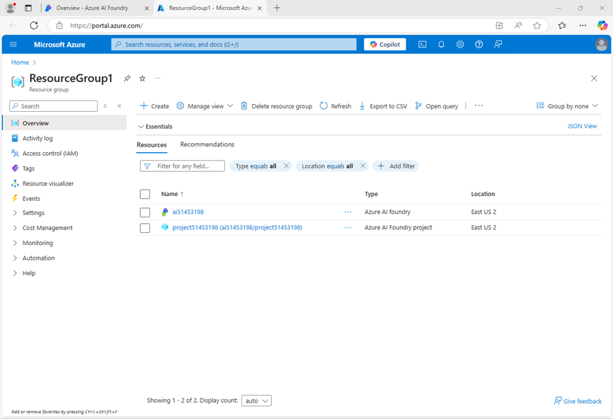
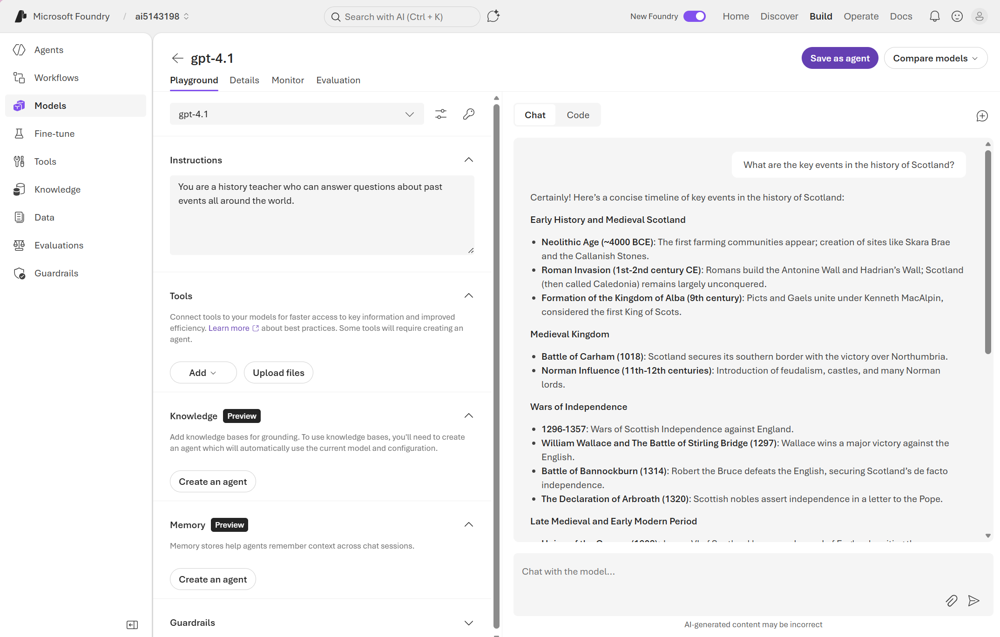

---
lab:
    title: 'Prepare for an AI development project'
    description: 'Learn how to organize cloud resources in Microsoft Foundry projects so that developers are set up for success when building AI solutions.'
---

# Prepare for an AI development project

In this exercise, you use Microsoft Foundry portal to create a project, ready to build an AI solution.

This exercise takes approximately **30** minutes.

> **Note**: Some of the technologies used in this exercise are in preview or in active development. You may experience some unexpected behavior, warnings, or errors.

## Open Microsoft Foundry portal

Let's start by signing into Foundry portal.

1. In a web browser, open the [Foundry portal](https://ai.azure.com) at `https://ai.azure.com` and sign in using your Azure credentials. Close any tips or quick start panes that are opened the first time you sign in, and if necessary use the **Foundry** logo at the top left to navigate to the home page, which looks similar to the following image (close the **Help** pane if it's open):

    

1. Review the information on the home page.

1. In the top banner, select **Start building** to try the new Microsoft Foundry Experience.

## Create a project

An Azure AI *project* provides a collaborative workspace for AI development. 

> **Note**: AI Foundry projects can be based on an *Foundry* resource, which provides access to AI models (including Azure OpenAI), Azure AI services, and other resources for developing AI agents and chat solutions. Alternatively, projects can be based on *AI hub* resources; which include connections to Azure resources for secure storage, compute, and specialized tools. Foundry based projects are great for developers who want to manage resources for AI agent or chat app development. AI hub based projects are more suitable for enterprise development teams working on complex AI solutions.

1. When prompted, create a **new** project, and enter a valid name for your project.

    

1. Expand **Advanced options** and specify the following settings:
    - **Foundry resource**: *A valid name for your Foundry resource*
    - **Subscription**: *Your Azure subscription*
    - **Resource group**: *Select your resource group, or create a new one*
    - **Region**: *Select any **AI Foundry recommended***\**

    > \* Some Azure AI resources are constrained by regional model quotas. In the event of a quota limit being exceeded later in the exercise, there's a possibility you may need to create another resource in a different region.

1. Select **Create** and wait for your project to be created.

1. After your project is created, select **Build** from the navigation bar.

1. Select **Models** from the left-hand menu, and then select **Deploy a base model**.

1. Enter **gpt-4.1** in the search box, and then select the **gpt-4.1** model from the search results.

1. Select **Deploy** with the default settings to create a deployment of the model.

1. When your project is created, the model playground will be opened automatically so you can test your model:

    

1. In the top navigation bar, select **Home** to see the main page for your project; which looks like this:

    

1. In the top navigation bar, select **Operate**. The operation center is where you can monitor your projects, view alerts, monitor agent performance and quotas, and manage resources.

    

1. In the left navigation pane, select the **Admin** page to view details.
    
    The *resource* level relates to the **Foundry** resource that was created to support your project. This resource includes connections to Azure AI Services and Foundry models; and provides a centralplace to manage user access to AI development projects.

    The *project* level relates to your individual project, where you can add and manage project-specific resources.

1. Select the link to the **Parent resource** associated with the project to open a new browser tab and navigate to the Azure portal. Sign in with your Azure credentials if prompted.

1. View the resource group in the Azure portal to see the Azure resources that have been created to support your Foundry resource and your project.

    

    Note that the resources have been created in the region you selected when creating the project.

1. Close the Azure portal tab and return to the Foundry portal.

## Review project endpoints

The Foundry project includes a number of *endpoints* that client applications can use to connect to the project and the models and AI services it includes.

1. In the top navigation bar, select **Home**.
1. In the project home page, observe the project details; which contains endpoint and project API key that you can use in your application code to access:
    - The Foundry project and any models deployed in it.
    - Azure OpenAI in Foundry models.
    - Azure AI services

## Test a generative AI model

Now that you know something about the configuration of your Foundry project, you can return to the chat playground to explore the model you deployed.

1. In the top navigation bar, select **Build**.
1. In the navigation pane on the left for your project, select **Models** 
1. Select the **gpt-4.1** model deployment that you created earlier to open the model playground.
1. In the **Instructions** box, enter the following instructions:

    ```
   You are a history teacher who can answer questions about past events all around the world.
    ```

1. Apply the changes to update the system message.
1. In the chat window, enter a query such as `What are the key events in the history of Scotland?` and view the response:

    

## Summary

In this exercise, you've explored Foundry, and seen how to create and manage projects and their related resources.

## Clean up

If you've finished exploring Foundry portal, you should delete the resources you have created in this exercise to avoid incurring unnecessary Azure costs.

1. In the [Azure portal](https://portal.azure.com) at `https://portal.azure.com`, view the contents of the resource group where you deployed the resources used in this exercise.
1. On the toolbar, select **Delete resource group**.
1. Enter the resource group name and confirm that you want to delete it.
