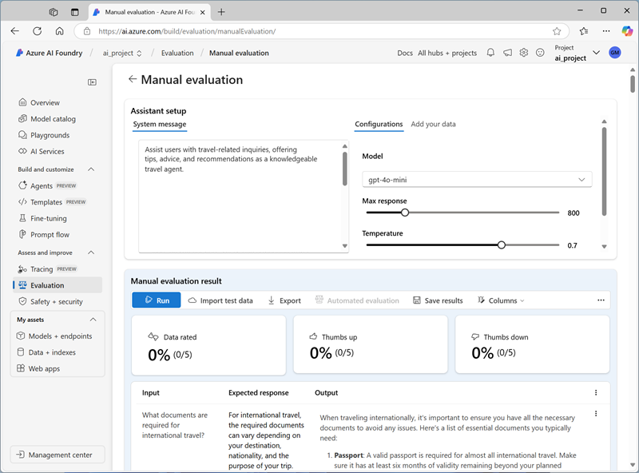
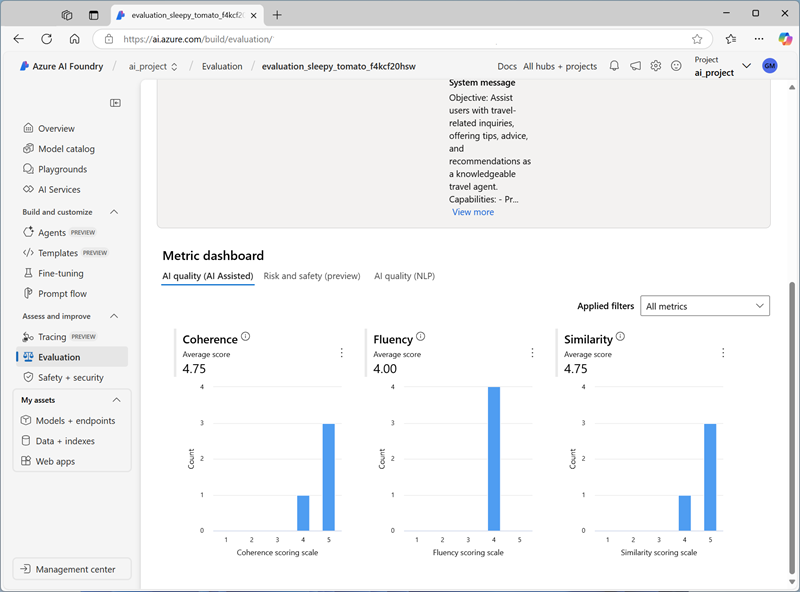

---
lab:
    title: 'Explore models and evaluate performance'
    description: 'Explore the model catalog to find and compare models, then evaluate model performance using manual and automated evaluations in the Microsoft Foundry portal.'
    level: 300
    duration: 45
---

# Explore models and evaluate performance

The Microsoft Foundry model catalog serves as a central repository where you can explore and use a variety of models, facilitating the creation of your generative AI scenario. In this exercise, you'll explore the model catalog, compare models using benchmarks, test models in the chat playground, and then evaluate model performance using both manual and automated evaluation workflows.

This exercise will take approximately **45** minutes.

> **Note**: Some of the technologies used in this exercise are in preview or in active development. You may experience some unexpected behavior, warnings, or errors.

## Explore models in the catalog

Let's start by signing into the Foundry portal and exploring some of the available models.

1. In a web browser, open the [Microsoft Foundry portal](https://ai.azure.com) at `https://ai.azure.com` and sign in using your Azure credentials. Close any tips or quick start panes that are opened the first time you sign in.
1. In the top navigation bar, select **Discover** and then select **Models** to open the model catalog.
1. In the model catalog, search for `gpt-4.1`.
1. In the search results, select the **gpt-4.1** model to see its details.
1. Read the description and review the other information available on the **Overview** tab.
1. On the **gpt-4.1** page, view the **Benchmarks** tab to see how the model compares across some standard performance benchmarks with other models that are used in similar scenarios.
1. Use the back arrow (**&larr;**) next to the **gpt-4.1** page title to return to the model catalog.
1. Search for `Phi-4-reasoning` and view the details and benchmarks for the **Phi-4-reasoning** model.

## Compare models using the model leaderboard

Now let's use the model leaderboard and side-by-side comparison features to compare models visually.

1. Use the back arrow (**&larr;**) to return to the model catalog.
1. In the **Model leaderboards** section, review the top models ranked by quality, safety, cost, and performance. Select **Go to leaderboard** to explore the full suite of leaderboards.
1. On the leaderboard page, review the **Quality** leaderboard to see which models score highest for AI quality metrics.
1. Scroll down to use the trade-off charts to compare models on multiple dimensions. Select the **Estimated cost** from the dropdown to see how model quality relates to estimated cost. Note where gpt-4.1, gpt-4o-mini, and Phi-4-reasoning fall on the chart.
1. Select the **Safety** from the dropdown to see how quality relates to safety scores.
1. In the table just above the trade-off charts, you can compare benchmarks. Select a few models (such as **gpt-4.1**, **gpt-4o-mini**, and **Phi-4-reasoning**).
1. Select **Compare models** to open the side-by-side comparison view.
1. Review the comparison across the following data:
    - **Performance benchmarks**: Quality, safety, and throughput scores
    - **Model details**: Context window, training date, and supported languages
    - **Supported features**: Capabilities like function calling, structured output, and vision

    Based on the benchmarks and comparison, consider the trade-offs between quality, cost, and capabilities across these models.

1. Close the comparison view.

## Create a Foundry project

To deploy and test models, you need to create a Foundry *project*.

1. Select the project name in the upper-left corner of the portal, and then select **Create new project**.
1. Enter a valid name for your project and select **Advanced options**.
1. In the **Advanced options** section, specify the following settings for your project:
    - **Resource group**: *Create or select a resource group*
    - **Location**: *Select any available region*\*

    > \* Some Azure AI resources are constrained by regional model quotas. In the event of a quota limit being exceeded later in the exercise, there's a possibility you may need to create another resource in a different region.

1. Select **Create project** and wait for your project to be created.

## Deploy models

Now let's deploy the models we'll use for testing and evaluation. You need to deploy **gpt-4.1** and **gpt-4o-mini**.

### Deploy the gpt-4.1 model

1. In the top navigation bar, select **Discover** and then select **Models**.
1. Search for `gpt-4.1` and select it.
1. On the model page, select **Deploy** > **Default settings** to add it to your project.
1. Note the deployment name (for example, `gpt-4.1`).

### Deploy the gpt-4o-mini model

1. Return to the model catalog by selecting **Discover** > **Models** in the top navigation.
1. Search for `gpt-4o-mini` and select it.
1. On the model page, select **Deploy** > **Default settings** to add it to your project.
1. Note the deployment name (for example, `gpt-4o-mini`).

## Test models in the chat playground

Now that you have two model deployments, let's test and compare them in the chat playground.

### Chat with the *gpt-4.1* model

1. In the left pane, select **Playgrounds** and then open the **Chat playground**.
1. In the chat playground, ensure that your **gpt-4.1** model is selected. In the **System message** field, set the system prompt to `You are an AI assistant that helps solve problems.`
1. Select **Apply changes** to update the system prompt.
1. In the chat window, enter the following query:

    ```
   I have a fox, a chicken, and a bag of grain that I need to take over a river in a boat. I can only take one thing at a time. If I leave the chicken and the grain unattended, the chicken will eat the grain. If I leave the fox and the chicken unattended, the fox will eat the chicken. How can I get all three things across the river without anything being eaten?
    ```

1. View the response. Then, enter the following follow-up query:

    ```
   Explain your reasoning.
    ```

### Chat with the *gpt-4o-mini* model

1. In the chat playground, use the model drop-down list to switch to your **gpt-4o-mini** model deployment.
1. Set the same system prompt: `You are an AI assistant that helps solve problems.` and select **Apply changes**.
1. In a new chat session, enter the same river crossing puzzle and review the response.

### Perform a further comparison

1. Use the model drop-down list in the chat playground to switch between your models, testing both models with the following puzzle (the correct answer is 40):

    ```
   I have 53 socks in my drawer: 21 identical blue, 15 identical black and 17 identical red. The lights are out, and it is completely dark. How many socks must I take out to make 100 percent certain I have at least one pair of black socks?
    ```

1. Compare the responses from each model. Note any differences in accuracy, reasoning quality, and response style.

## Manually evaluate a model

You can manually review model responses based on test data. Manually reviewing allows you to test different inputs to evaluate whether the model performs as expected.

1. In a new browser tab, download the [travel_evaluation_data.jsonl](https://raw.githubusercontent.com/MicrosoftLearning/mslearn-ai-studio/refs/heads/main/labfiles/model-eval/travel_evaluation_data.jsonl) from `https://raw.githubusercontent.com/MicrosoftLearning/mslearn-ai-studio/refs/heads/main/labfiles/model-eval/travel_evaluation_data.jsonl` and save it in a local folder as **travel_evaluation_data.jsonl** (be sure to save it as a .jsonl file, not a .txt file).
1. Back on the Foundry portal tab, in the left pane, select **Evaluation**.
1. If the **Create** pane opens automatically, select **Cancel** to close it.
1. In the **Evaluation** page, view the **Manual evaluations** tab and select **+ New manual evaluation**.
1. In the **Configurations** section, in the **Model** list, select your **gpt-4.1** model deployment.
1. Change the **System message** to the following instructions for an AI travel assistant:

   ```
   Assist users with travel-related inquiries, offering tips, advice, and recommendations as a knowledgeable travel agent.
   ```

1. In the **Manual evaluation result** section, select **Import test data** and upload the **travel_evaluation_data.jsonl** file you downloaded previously; scrolling down to map the dataset fields as follows:
    - **Input**: Question
    - **Expected response**: ExpectedResponse
1. Review the questions and expected answers in the test file — you'll use these to evaluate the responses that the model generates.
1. Select **Run** from the top bar to generate outputs for all questions you added as inputs. After a few minutes, the responses from the model should be shown in a new **Output** column.

    

1. Review the outputs for each question, comparing the output from the model to the expected answer and "scoring" the results by selecting the thumbs up or down icon at the bottom right of each response.
1. After you've scored the responses, review the summary tiles above the list. Then in the toolbar, select **Save results** and assign a suitable name. Saving results enables you to retrieve them later for further evaluation or comparison with a different model.

## Use automated evaluation

While manually comparing model output to your own expected responses can be a useful way to assess a model's performance, it's a time-consuming approach in scenarios where you expect a wide range of questions and responses; and it provides little in the way of standardized metrics that you can use to compare different model and prompt combinations.

Automated evaluation is an approach that attempts to address these shortcomings by calculating metrics and using AI to assess responses for coherence, relevance, and other factors.

1. Use the back arrow (**&larr;**) next to the **Manual evaluation** page title to return to the **Evaluation** page.
1. View the **Automated evaluations** tab.
1. Select **Create**, and when prompted, select the option to **Evaluate a model** and select **Next**.
1. On the **Select data source** page, select **Use your dataset** and select the **travel_evaluation_data_jsonl_*xxxx...*** dataset based on the file you uploaded previously, and select **Next**.
1. On the **Test your model** page, select the **gpt-4o-mini** model and change the **System message** to the same instructions for an AI travel assistant you used previously:

   ```
   Assist users with travel-related inquiries, offering tips, advice, and recommendations as a knowledgeable travel agent.
   ```

1. For the **query** field, select **\{\{item.question\}\}**.
1. Select **Next** to move to the next page.
1. On the **Configure evaluators** page, use the **+Add** button to add the following evaluators, configuring each one as follows:
    - **Model scorer**:
        - **Criteria name**: *Select the **Semantic_similarity** preset*
        - **Grade with**: *Select your **gpt-4.1** model*
        - **User** settings (at the bottom):

            Output: \{\{sample.output_text\}\}<br>
            Ground Truth: \{\{item.ExpectedResponse\}\}<br>
            <br>
        
    - **Likert-scale evaluator**:
        - **Criteria name**: *Select the **Relevance** preset*
        - **Grade with**: *Select your **gpt-4.1** model*
        - **Query**: \{\{item.question\}\}

    - **Text similarity**:
        - **Criteria name**: *Select the **F1_Score** preset*
        - **Ground truth**: \{\{item.ExpectedResponse\}\}

    - **Hateful and unfair content**:
        - **Criteria name**: Hate_and_unfairness
        - **Query**: \{\{item.question\}\}

1. Select **Next** and review your evaluation settings. You should have configured the evaluation to use the travel evaluation dataset to evaluate the **gpt-4o-mini** model for semantic similarity, relevance, F1 score, and hateful and unfair language. The **gpt-4.1** model is being used as the grading model for AI-assisted evaluators.
1. Give the evaluation a suitable name, and **Submit** it to start the evaluation process, and wait for it to complete. It may take a few minutes. You can use the **Refresh** toolbar button to check the status.

1. When the evaluation has completed, scroll down if necessary to review the results.

    

1. At the top of the page, select the **Data** tab to see the raw data from the evaluation. The data includes the metrics for each input as well as explanations of the reasoning the gpt-4.1 model applied when assessing the responses.

## Reflect on the models

You've explored models in the catalog, compared them using benchmarks and the leaderboard, tested them interactively in the playground, and evaluated them using both manual and automated approaches. This comprehensive workflow lets you:

- **Discover** models suited to your scenario using the catalog and leaderboard
- **Compare** models visually using trade-off charts and side-by-side views
- **Test** models interactively to get a feel for their response quality
- **Evaluate** models systematically using standardized metrics and AI-assisted grading

In any generative AI scenario, you need to find a model with the right balance of suitability for the task you need it to perform and the cost of using the model for the number of requests you expect it to have to handle. The combination of catalog exploration, playground testing, and systematic evaluation provides a robust approach to model selection.

## Clean up

If you've finished exploring the Foundry portal, you should delete the resources you have created in this exercise to avoid incurring unnecessary Azure costs.

1. Open the [Azure portal](https://portal.azure.com) and view the contents of the resource group where you deployed the resources used in this exercise.
1. On the toolbar, select **Delete resource group**.
1. Enter the resource group name and confirm that you want to delete it.
