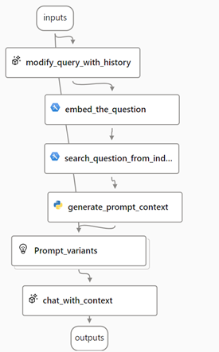

---
lab:
    title: 'Create a custom copilot that uses your own data'
---

# Create a custom copilot that uses your own data

Retrieval Augmented Generation (RAG) is a technique used to build applications that integrate data from custom data sources into a prompt for a generative AI model. RAG is a commonly used pattern for developing custom *copilots* - chat-based applications that use a language model to interpret inputs and generate appropriate responses.

In this exercise, you'll use Azure AI Studio to integrate custom data into a generative AI prompt flow.

> **Note**: Azure AI Studio is in preview at the time of writing, and is under active development. Some elements of the service may not be exactly as-described, and some features may not work as expected.

This exercise takes approximately **45** minutes.

## Create an Azure AI Search resource

Your copilot solution will integrate custom data into a prompt flow. To support this integration, you'll need an Azure AI Search resource with which to index your data.

1. In a web browser, open the [Azure portal](https://portal.azure.com) at `https://portal.azure.com` and sign in using your Azure credentials.
1. On the home page, select **+ Create a resource** and search for `Azure AI Search`. Then create a new Azure AI Search resource with the following settings:
    - **Subscription**: *Select your Azure subscription*
    - **Resource group**: *Select or create a resource group*
    - **Service name**: *Enter a unique service name*
    - **Location**: *Select any available location*
    - **Pricing tier**: Standard
1. Wait for your Azure AI Search resource deployment to be completed.

## Create an Azure AI project

Now you're ready to create an Azure AI Studio project and the Azure AI resources to support it.

1. In a web browser, open [Azure AI Studio](https://ai.azure.com) at `https://ai.azure.com` and sign in using your Azure credentials.
1. on the **Build** page, select **+ New project**. Then, in the **Create a new project** wizard, create a project with the following settings:
    - **Project name**: *A unique name for your project*
    - **AI Hub**: *Create a new resource with the following settings:*
        - **AI Hub name**: *A unique name*
        - **Azure Subscription**: *Your Azure subscription*
        - **Resource group**: *Select the resource group containing your Azure Ai Search resource*
        - **Location**: *The same location as your Azure AI Search resource (or a location geographically near it)*
        - **Azure OpenAI**: (New) *hub_name*
        - **Azure AI Search**: *Select your Azure AI Search resource*
1. Wait for your project to be created.

## Deploy models

You'll need two models to implement your solution:

- An *embedding* model to vectorize text data for efficient indexing and processing.
- A model that can generate natural language responses to questions based on your data.

1. In Azure AI Studio, in your project, in the navigation pane on the left, under **Components**, select the **Deployments** page.
1. Create a new deployment of the **text-embedding-ada-002** model with the name `text-embedding-ada-002`. Set the **Advanced** options to use the default content filter and to restrict the tokens-per-minute (TPM) to **5K**.
1. Create a new deployment of the **gpt-35-turbo** model with the name `gpt-35-turbo`. Set the **Advanced** options to use the default content filter and to restrict the tokens-per-minute (TPM) to **5K**.

> **Note**: Reducing the TPM helps avoid over-using the quota available in the subscription you are using. 5,000 TPM is sufficient for the data used in this exercise.

## Add data to your project

The data for your copilot consists of a set of travel brochures in PDF format from the fictitious travel agency *Margie's Travel*. Let's add them to the project.

1. Download the [zipped archive of brochures](https://github.com/MicrosoftLearning/mslearn-ai-studio/raw/main/data/brochures.zip) from `https://github.com/MicrosoftLearning/mslearn-ai-studio/raw/main/data/brochures.zip` and extract it to a folder named **brochures** on your local file system.
1. In Azure AI Studio, in your project, in the navigation pane on the left, under **Components**, select the **Data** page.
1. Select **+ New data** and add a new data source connection by uploading the **brochures** folder (choose the option to upload a *folder*, not a *file*). Name the new data source **brochures**.

## Create an index for your data

Now that you've added a data source to your project, you can use it to create an index in your Azure AI Search resource.

1. In Azure AI Studio, in your project, in the navigation pane on the left, under **Components**, select the **Indexes** page.
1. Add  a new index with the following settings:
    - **Source data**:
        - **Data source**: Use existing project data
            - *Select the **brochures** data source*
    - **Index storage**:
        - *Select the **AzureAISearch** connection to your Azure AI Search resource*
    - **Search settings**:
        - **Search type**: Vector
        - **Azure OpenAI Resource**: Default_AzureOpenAI
        - *Acknowledge that an embedding model will be deployed*
    - **Index settings**:
        - **Index name**: brochures-index
        - **Virtual machine**: Auto select
1. Wait for your index to be created, which can take several minutes. The index creation operation consists of the following jobs:
    - Validating deployment of the embedding model that will be used to create embedding vectors for your data
    - Chunking the text data into smaller units for indexing
    - Creating embeddings for the text tokens in your chunked data
    - Creating the index
    - Registering the index asset

## Test the index

Before using your index in a RAG-based prompt flow, let's verify that it can be used to affect generative AI responses.

1. In the navigation pane on the left, under **Tools**, select the **Playground** page.
1. On the Playground page, in the **Configuration** pane, ensure that your **gpt-35-turbo** model deployment is selected. Then, in the **Chat session** pane, submit the prompt `Where can I stay in New York?`
1. Review the response, which should be a generic answer from the model without any data from the index.
1. In the **Assistant setup** pane, select **Add your data** and then add a data source with the following settings:
    - **Data source**:
        - **Select data source**: Azure AI Search
        - **Subscription**: *Your Azure subscription*
        - **Azure AI Search service**: *Your Azure AI Search resource*
        - **Azure AI Search index**: brochures-index
        - **Add vector search**: <u>un</u>selected
    - **Data field mapping**:
        - **Content data**: content
        - **File name**: filepath
        - **Title**: title
        - **URL**: url
    - **Data management**:
        - **search type**: keyword
1. After the data source has been added and the chat session has restarted, resubmit the prompt `Where can I stay in New York?`
1. Review the response, which should be based on data in the index.

## Use the index in a prompt flow

Your vector index has been saved in your Azure AI Studio project, enabling you to use it easily in a prompt flow.

1. In Azure AI Studio, in your project, in the navigation pane on the left, under **Components**, select **Data**.
1. Select the **brochures-index** folder which contains the data for the index you created previously.
1. In the **Data links** section for your index, copy the **Storage URI** value to the clipboard (it should resemble `https://xxx.blob.core.windows.net/xxx/azureml/xxx/index/`). You will need this URI to connect to your index data in the prompt flow.
1. In your project, in the navigation pane on the left, under **Tools**, select the **Prompt flow** page.
1. Create a new prompt flow by cloning the **Multi-Round Q&A on Your Data** sample in the gallery. Save your clone of this sample in a folder named `brochure-flow`.
1. When the prompt flow designer page opens, review **brochure-flow**. Its graph should resemble the following image:

    

    The sample prompt flow you are using implements the prompt logic for a chat application in which the user can iteratively submit text input to chat interface. The conversational history is retained and included in the context for each iteration. The prompt flow orchestrate a sequence of *tools* to:

    1. Append the history to the chat input to define a prompt in the form of a contextualized form of a question.
    1. Create an *embedding* for the question (use an embedding model to convert the text to vectors).
    1. Search a vector index for relevant information based on the question.
    1. Generate prompt context by using the retrieved data from the index to augment the question.
    1. Create prompt variants by adding a system message and structuring the chat history.
    1. Submit the prompt to a language model to generate a natural language response.

1. In the **Runtime** list, select **Start** to start the automatic runtime. Then wait for it to start. This provides a compute context for the prompt flow. While you're waiting, in the **Flow** tab, review the sections for the tools in the flow.
1. In the **Inputs** section, ensure that the inputs include **chat_history** and **chat_input**. The default chat history in this sample includes some conversation about AI.
1. In the **Outputs** section, ensure that the **chat_output** value is *${chat_with_context.output}*.
1. In the **modify_query_with_history** section, select the following settings (leaving others as they are):
    - **Connection**: Default_AzureOpenAI
    - **Api**: Chat
    - **deployment_name**: gpt-35-turbo
    - **response_format**: {"type":"text"}
1. In the **embed_the_question** section, set the following parameter values:
    - **Connection** *(Azure OpenAI, OpenAI)*: Default_AzureOpenAI
    - **deployment_name** *(string)*: text-embedding-ada-00
    - **input** *(string)*: ${modify_query_with_history.output}
1. In the **search_question_from_indexed_docs** section, set the following parameter values:
    - **path** *(string)*: *Paste the URI for your vector index*
    - **query** *(object)*: ${embed_the_question.output}
    - **top_k** *(int)*: 2
1. In the **generate_prompt_context** section, review the Python script and ensure that the **inputs** for this tool include the following parameter:
    - **search_result** *(object)*: ${search_question_from_indexed_docs.output}
1. In the **Prompt_variants** section, review the Python script and ensure that the **inputs** for this tool include the following parameters:
    - **contexts** *(string)*: ${generate_prompt_context.output}
    - **chat_history** *(string)*: ${inputs.chat_history}
    - **chat_input** *(string)*: ${inputs.chat_input}
1. In the **chat_with_context** section, select the following settings (leaving others as they are):
    - **Connection**: Default_AzureOpenAI
    - **Api**: Chat
    - **deployment_name**: gpt-35-turbo
    - **response_format**: {"type":"text"}

    Then ensure that the **inputs** for this tool include the following parameters:
    - **prompt_text** *(string)*: ${Prompt_variants.output}

1. On the toolbar, use the **Save** button to save the changes you've made to the tools in the prompt flow.
1. On the toolbar, select **Chat**. A chat pane opens with the sample conversation history and the input already filled in based on the sample values. You can ignore these.
1. In the chat pane, replace the default input with the question `Where can I stay in London?` and submit it.
1. Review the response, which should be based on data in the index.
1. Review the outputs for each tool in the flow.
1. In the chat pane, enter the question `What can I do there?`
1. Review the response, which should be based on data in the index and take into account the chat history (so "there" is understood as "in London").
1. Review the outputs for each tool in the flow, noting how each tool in the flow operated on its inputs to prepare a contextualized prompt and get an appropriate response.

## Deploy the flow

Now that you have a working flow that uses your indexed data, you can deploy it as a service to be consumed by a copilot application.

1. On the toolbar, select **Deploy**.
1. Create a deployment with the following settings:
    - **Basic settings**:
        - **Endpoint**: New
        - **Endpoint name**: brochure-endpoint
        - **Deployment name**: brochure-endpoint-1
        - **Virtual machine**: Standard_DS3_v2
        - **Instance count**: 3
        - **Inferencing data collection**: Selected
        - **Application insights diagnostics**: Selected
    - **Advanced settings**:
        - *Use the default settings*
1. In Azure AI Studio, in your project, in the navigation pane on the left, under **Components**, select the **Deployments** page.
1. Keep refreshing the view until the **brochure-endpoint-1** deployment is shown as having *succeeded* under the **brochure-endpoint** endpoint (this may take some time).
1. When the deployment has succeeded, select it. Then, on its **Test** page, enter the prompt `What is there to do in San Francisco?` and review the response.
1. Enter the prompt `Where else could I go?` and review the response.
1. View the **Consume** page for the endpoint, and note that it contains connection information and sample code that you can use to build a client application for your endpoint - enabling you to integrate the prompt flow solution into an application as a custom copilot.

## Clean up

To avoid unnecessary Azure costs and resource utilization, you should remove the resources you deployed in this exercise.

1. In Azure AI Studio, view the **Build** page. Then select the project you created in this exercise and use the **Delete project** button to remove it. It may take a few minutes to delete all of the components.
1. If you've finished exploring Azure AI Studio, return to the [Azure portal](https://portal.azure.com) at `https://portal.azure.com` and sign in using your Azure credentials if necessary. Then delete the resource group you created for your Azure AI Search and Azure AI resources.

