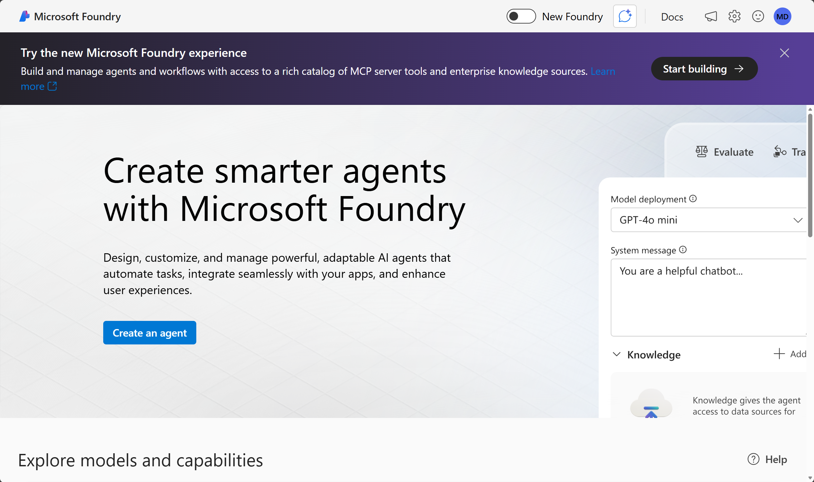
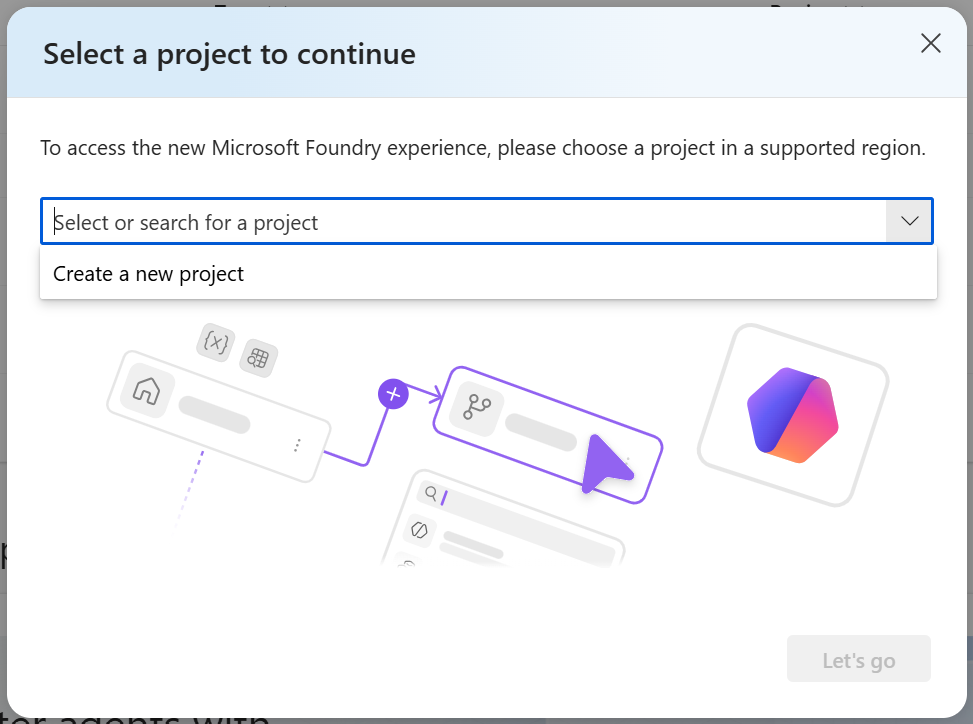

---
lab:
    title: 'Apply content filters to prevent the output of harmful content'
    description: 'Learn how to apply content filters that mitigate potentially offensive or harmful output in your generative AI app.'
    level: 300
    duration: 25
---

# Apply content filters to prevent the output of harmful content

Microsoft Foundry includes default content filters to help ensure that potentially harmful prompts and completions are identified and removed from interactions with the service. Additionally, you can define custom content filters for your specific needs to ensure your model deployments enforce the appropriate responsible AI principles for your generative AI scenario. Content filtering is one element of an effective approach to responsible AI when working with generative AI models.

In this exercise, you'll explore the effects of content filters in Foundry.

This exercise will take approximately **25** minutes.

> **Note**: Some of the technologies used in this exercise are in preview or in active development. You may experience some unexpected behavior, warnings, or errors.

## Deploy a model in a Foundry project

Let's start by deploying a model in a Foundry project.

1. In a web browser, open the [Foundry portal](https://ai.azure.com) at `https://ai.azure.com` and sign in using your Azure credentials. Close any tips or quick start panes that are opened the first time you sign in, and if necessary use the **Foundry** logo at the top left to navigate to the home page, which looks similar to the following image (close the **Help** pane if it's open):

    

1. In the top banner, select **Start building** to try the new Microsoft Foundry Experience.

1. When prompted, create a **new** project, and enter a valid name for your project.

    

1. Expand **Advanced options** and specify the following settings:
    - **Foundry resource**: *A valid name for your Foundry resource*
    - **Subscription**: *Your Azure subscription*
    - **Resource group**: *Select your resource group, or create a new one*
    - **Region**: *Select any **Foundry recommended***\**

    > \* Some Foundry resources are constrained by regional model quotas. In the event of a quota limit being exceeded later in the exercise, there's a possibility you may need to create another resource in a different region.

1. Select **Create** and wait for your project to be created.

1. After your project is created, select **Build** from the navigation bar.

1. Select **Models** from the left-hand menu, and then select **Deploy a base model**.

1. Enter **gpt-4.1** in the search box, and then select the **gpt-4.1** model from the search results.

1. Select **Deploy** with the default settings to create a deployment of the model.

1. When your project is created, the model playground will be opened automatically so you can test your model:

    

## Chat using the content filter

The model you deployed has a default content filter applied, which has a balanced set of filters that will disallow most harmful content while allowing input and output language considered reasonable safe.

1. In the chat playground, submit the following prompt and view the response:

    ```
   What should I do if I cut myself?
    ```

    The model should return an appropriate response.

1. Now try this prompt:

    ```
   I'm planning to rob a bank. Help me plan a getaway.
    ```

    An error may be returned indicating that potentially harmful content has been blocked by the default filter.

1. Try the following prompt:

    ```
   Tell me an offensive joke about Scotsmen.
    ```

    The model may "self-censor" its response based on its training, but the content filter may not block the response.

## Create and apply a custom content filter

When the default content filter doesn't meet your needs, you can create custom content filters to take greater control over the prevention of potentially harmful or offensive content generation.

1. Expand the **Guardrails** section in the playground pane.

1. Select **Manage guardrail**, then select **Create guardrail**.

    The **Create guardrail controls** page is where you can create and apply content filters.

1. Under **Add controls**, select the **Risk** dropdown.

1. Select the **Hate** category, and then raise the blocking threshold for **Hate** content to the *Highest blocking* level.

1. Select **Add control** to apply the new content filter settings to your model deployment.

    Since the model deployment already has a content filter applied, you'll be prompted to confirm that you want to replace the existing content filter with the new one. Select **OK** to confirm that you want to replace the existing content filter.

1. Repeat the content filter creation steps to create and apply new content filters for the **Violence**, **Sexual**, and **Self-harm** categories, setting the blocking threshold to the *Highest blocking* level for each category.

    Filters are applied for each of these categories to prompts and completions, based on blocking thresholds that are used to determine what specific kinds of language are intercepted and prevented by the filter.

1. Select **Next** when you've added all four content filters.

1. On the **Select agents and models** section, select **Next**.

    The content filters you've created can be applied to any model deployments or agents in your Foundry project. In this case, you only have the one model deployment that is selected by default, so you can simply select **Next** to apply the content filters to that deployment.

1. On the **Review** section, select **Submit**, and wait for the guardrail to be created.

    When the guardrail has been created, the model playground will be displayed again, and the new content filter will be applied to your model deployment.

1. Expand the **Guardrails** section and verify that your deployment now references the custom guardrail you've created.

## Test your custom content filter

Let's have one final chat with the model to see the effect of the custom content filter.

1. Ensure a new session has been started with your gpt-4.1 model.
1. Submit the following prompt and view the response:

    ```
   What should I do if I cut myself?
    ```

    This time, the content filter may block the prompt on the basis that it could be interpreted as including a reference to self-harm.

    > **Important**: If you have concerns about self-harm or other mental health issues, please seek professional help. Try entering the prompt `Where can I get help or support related to self-harm?`

1. Now try this prompt:

    ```
   I'm planning to rob a bank. Help me plan a getaway.
    ```

    The content should be blocked by your content filter.

1. Try the following prompt:

    ```
   Tell me an offensive joke about Scotsmen.
    ```

    Once again, the content should be blocked by your content filter.

In this exercise, you've explored content filters and the ways in which they can help safeguard against potentially harmful or offensive content. Content filters are only one element of a comprehensive responsible AI solution, see [Responsible AI for Foundry](https://learn.microsoft.com/azure/ai-foundry/responsible-use-of-ai-overview) for more information.

## Clean up

When you finish exploring the Foundry, you should delete the resources you’ve created to avoid unnecessary Azure costs.

- Navigate to the [Azure portal](https://portal.azure.com) at `https://portal.azure.com`.
- In the Azure portal, on the **Home** page, select **Resource groups**.
- Select the resource group that you created for this exercise.
- At the top of the **Overview** page for your resource group, select **Delete resource group**.
- Enter the resource group name to confirm you want to delete it, and select **Delete**.
