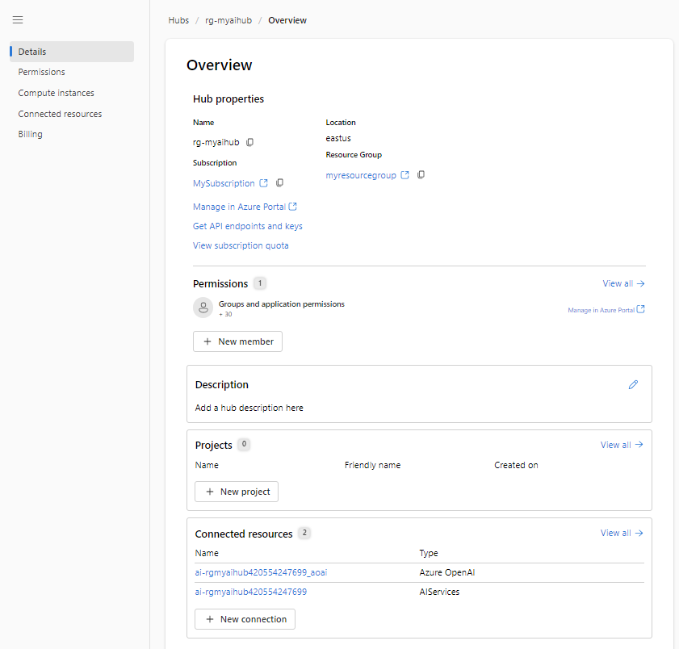

---
lab:
    title: 'Explore model catalog in Azure AI Studio'
---

# Explore model catalog in Azure AI Studio

The Azure AI Studio’s model catalog serves as a central repository where you can explore and use a variety of models, facilitating the creation of your generative AI scenario.

In this exercise, you'll explore the model catalog in Azure AI Studio.

> **Note**: Azure AI Studio is in preview at the time of writing, and is under active development. Some elements of the service may not be exactly as described, and some features may not work as expected.

> To complete this exercise, your Azure subscription must be approved for access to the Azure OpenAI service.

This exercise will take approximately **25** minutes.

## Create an Azure AI Hub

You need an Azure AI Hub in your Azure subscription to host projects. You can either create this resource while creating a project, or provision it ahead of time (which is what we'll do in this exercise).

1. In a web browser, open [https://ai.azure.com](https://ai.azure.com) and sign in using your Azure credentials.

1. On the Management section, select All hubs, then select **+ New hub**. Create a new hub with the following settings:
    - **Hub name**: *A unique name*
    - **Subscription**: *Your Azure subscription*
    - **Resource group**: *Create a new resource group with a unique name, or select an existing one*
    - **Location**: *Make a **random** choice from any of the following regions*\*
        - Australia East
        - Canada East
        - East US
        - East US 2
        - France Central
        - Japan East
        - North Central US
        - Sweden Central
        - Switzerland North
        - UK South
    - **Connect Azure AI Services or Azure OpenAI**: Select to create a new AI Services or use an existing one
    - **Connect Azure AI Search**: Skip connecting

    > \* Azure OpenAI resources are constrained at the tenant level by regional quotas. The listed regions include default quota for the model type(s) used in this exercise. Randomly choosing a region reduces the risk of a single region reaching its quota limit in scenarios where you are sharing a tenant with other users. In the event of a quota limit being reached later in the exercise, there's a possibility you may need to create another resource in a different region.

1. Select **Create**. The creation of the first hub may take a few minutes to complete. During the hub creation, the following AI resources will also be created for you: 
    - AI Services
    - Storage account
    - Key vault

1. After the Azure AI Hub has been created, it should look similar to the following image:

    

## Create a project

An Azure AI Hub provides a collaborative workspace within which you can define one or more *projects*. Let's create a project in your Azure AI Hub.

1. In Azure AI Studio, on the **Build** page, select **+ New project**. Then, in the **Create a new project** wizard, create a project with the following settings:

    - **Project name**: *A unique name for your project*
    - **Hub**: *Your AI Hub*

1. Wait for your project to be created. When it's ready, it should look similar to the following image:

    

1. View the pages in the pane on the left side, expanding each section, and note the tasks you can perform and the resources you can manage in a project.

## Deploy a model

Now you're ready to deploy a model to use through the **Azure AI Studio**. Once deployed, you will use the model to generate natural language content.

1. In Azure AI Studio, create a new deployment with the following settings:

    - **Model**: gpt-35-turbo
    - **Deployment type**: Standard
    - **Connected Azure OpenAI resource**: *Your Azure OpenAI connection*
    - **Model version:** Auto-update to default
    - **Deployment name**: *A unique name of your choice*
    - **Advanced options**
        - **Content filter**: Default
        - **Tokens per minute rate limit**: 5K

> **Note**: Each Azure AI Studio model is optimized for a different balance of capabilities and performance. We'll use the **GPT 3.5 Turbo** model in this exercise, which is highly capable for natural language generation and chat scenarios.

## Test the model in the chat playground

Let's see how the model behaves in a conversational interaction.

1. Navigate to the **Playground** in the left pane.

1. In the **Chat** mode, enter the following prompt in the **Chat session** section.

    ```
   <Placeholder>
    ```

1. The model will likely respond with some text ...

## Modify the system prompt message

In the chat playground, you can modify the system prompt to change the model’s behavior. The system prompt is the initial message that the model receives before it starts generating responses.

1. In the **System message** section, change the system message to the following text:

    ```
    <Placeholder>
    ```

1. Apply the changes to the system message.

1. In the **Chat session** section, re-enter the following prompt.

    ```
   <Placeholder>
    ```

8. Observe the output, which should hopefully indicate that the ...


## Add data in the chat playground

<Placeholder>

## Clean up

When you're done with your Azure OpenAI resource, remember to delete the deployment or the entire resource in the [Azure portal](https://portal.azure.com/?azure-portal=true).

