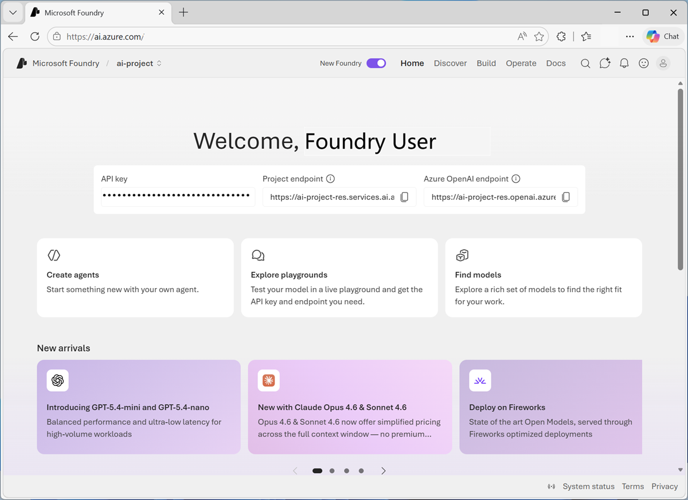
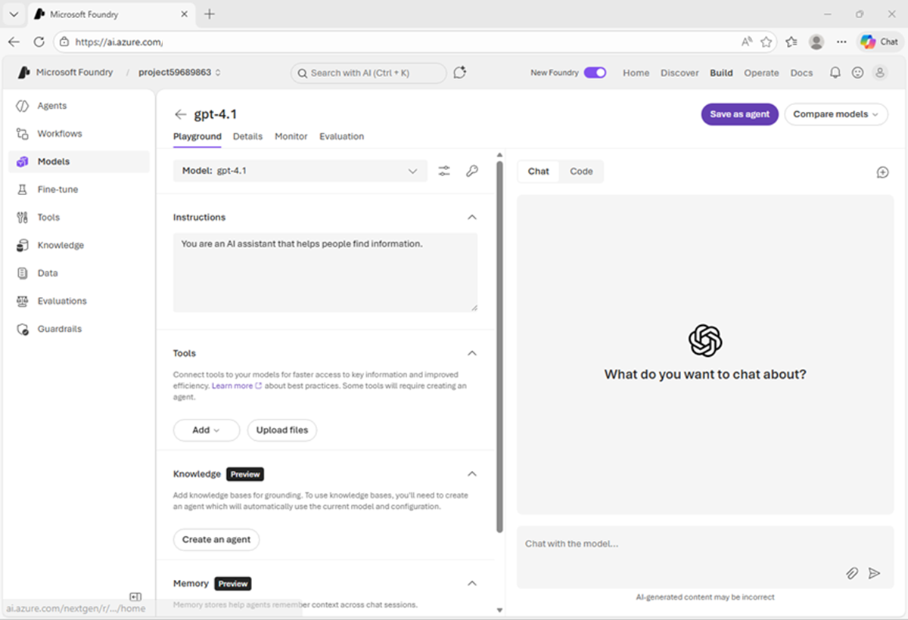
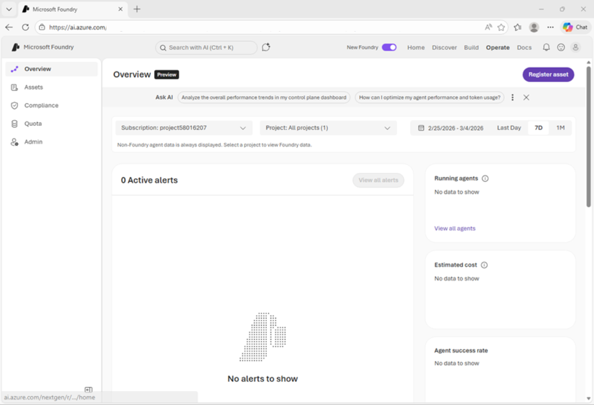
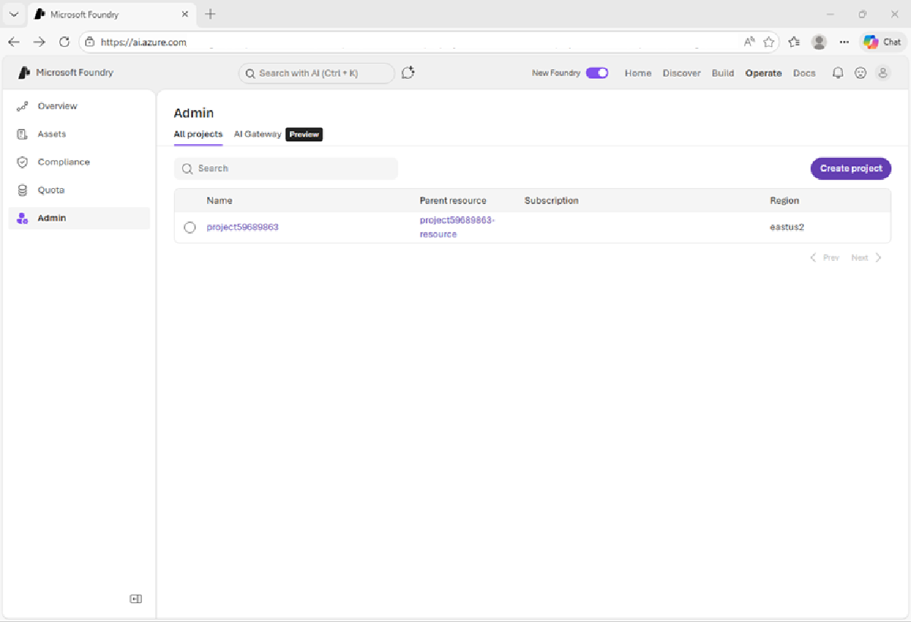
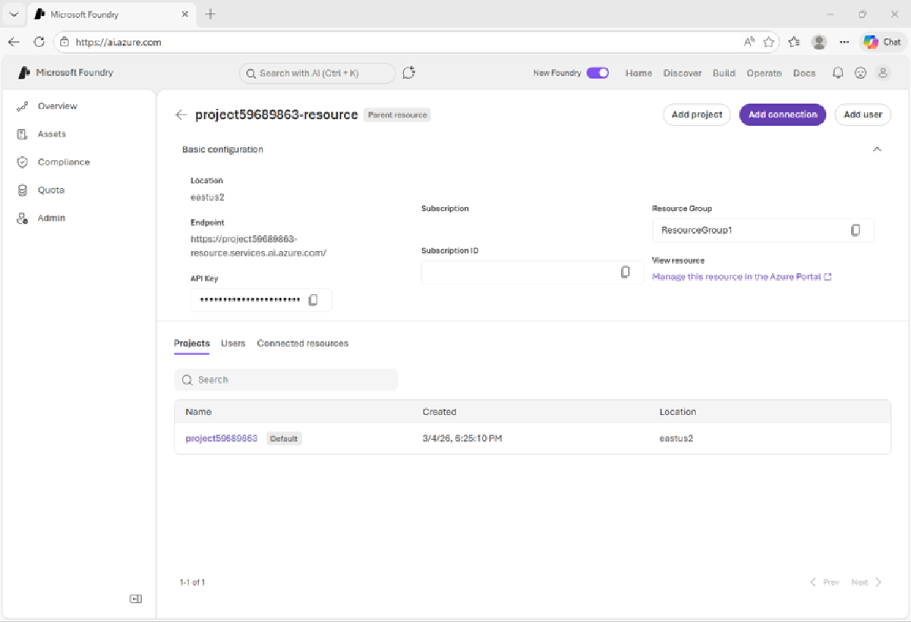

---
lab:
    title: 'Task 1 – Create a project and deploy a model'
    description: 'Create a Microsoft Foundry project for Wingtip Journeys, deploy a model, test it in the playground, and find the endpoints client applications use.'
    level: 200
    concepts: 'Foundry projects, model deployment, model playground, endpoints'
    islab: true
    status: 'draft'
---

# Task 1 — Create a project and deploy a model

*Part of the **Choose, evaluate, and safeguard a model** lab. New here? Start with [Getting started](A0-getting-started.md).*

> **What you need:** an **Azure subscription** with permission and quota to create Azure AI
> resources. That's all — this task creates everything else from scratch, and is completed
> entirely in the Microsoft Foundry portal, so there's no local code or configuration to set up.

---

Everything in a Foundry solution hangs off a **project**. A project is where your models,
data, evaluations, guardrails, and connections live, and it's what your application code
points at. In this task you'll create one for Wingtip Journeys, put a model in it, and find
the endpoints you'd hand to a developer.

<style>
/* "Ask Wren" just-in-time concept blocks */
details.concept { margin:.6rem 0 1rem; }
details.concept > summary { display:inline-block; cursor:pointer; list-style:none;
  font-size:.85em; font-weight:600; color:#0f6cbd; background:#0f6cbd12;
  border:1px solid #0f6cbd33; border-radius:999px; padding:.2em .7em; }
details.concept > summary::-webkit-details-marker { display:none; }
details.concept > summary::before { content:"Ask Wren: "; font-weight:700; }
details.concept > summary:hover { background:#0f6cbd; color:#fff; border-color:#0f6cbd; }
details.concept[open] > summary { border-bottom-left-radius:0; border-bottom-right-radius:0; }
details.concept .concept-body { border:1px solid #0f6cbd33; border-top:none;
  border-radius:0 8px 8px 8px; padding:.6rem .9rem; background:#0f6cbd08; font-size:.95em; }
</style>

<details markdown="1" class="concept">
<summary>Resource or project — what's the difference?</summary>
<div class="concept-body" markdown="1">

A **Foundry resource** is the Azure resource that gets billed and secured. It holds
connections to Foundry Services and models, and it's where you manage who can do what.

A **project** lives inside a resource and is the working container for one solution: its
models, data, evaluations, and guardrails. One resource can host many projects — the first
one you create becomes the resource's *default* project.

Both levels expose an endpoint, which is why you'll see more than one endpoint on the pages
below.

</div>
</details>

## Create a Microsoft Foundry project

Microsoft Foundry uses projects to organize models, resources, data, and other assets used to develop an AI solution.

1. In a web browser, open the [Microsoft Foundry portal](https://ai.azure.com) at `https://ai.azure.com` to start building; signing in using your Azure credentials. Close any tips or quick start panes that are opened the first time you sign in.

1. If it is not already enabled, in the tool bar at the top of the page, enable the **New Foundry** option. Then, create a new project with a unique name (for example, `wingtip-journeys`); expanding the **Advanced options** area to specify the following settings for your project:
    - **Foundry resource**: *Use the default name for your resource (usually {project_name}-resource)*
    - **Subscription**: *Your Azure subscription*
    - **Resource group**: *Create or select a resource group*
    - **Region**: Select any of the **AI Foundry recommended** regions in **[this list](https://learn.microsoft.com/azure/foundry/openai/how-to/responses#region-availability)**{:target="_blank"}

    > **Tip**: Make a note of the region you selected. You'll need it later!

1. Select **Create**. Wait for your project to be created.

    When it is ready, the project home page will open.

    

## Deploy and test a model

At the core of any generative AI project, there's at least one generative AI model.

1. Now you're ready to explore models. On the **Discover** page, select the **Models** tab to view the Microsoft Foundry model catalog.

1. Search for the `gpt-5.2` model, and then select it in the search results to view its model card.

    Model cards provide information about models to help you understand their capabilities and limitations, and determine if they are suitable for your requirements.

    

1. Select **Deploy** with the default settings to create a deployment of the model.

    Model deployments enable you to work with a model in your project.

    When the model has been deployed, the model playground will open automatically so you can test your model:

    

1. In the **Instructions** box, enter the following instructions:

    ```text
    You are the Wingtip Journeys travel assistant. You provide information and advice about destinations, itineraries, and trip planning.
    ```

1. In the chat window, enter a query such as `Describe three key considerations for planning a first trip to Japan.` and view the response.

    Hopefully the model gave you some useful things to think about — and a first sense of the
    voice it answers in. Keep that voice in mind: Task 6 is all about changing it.

## View Foundry resource and project endpoints

1. In the Foundry portal, in the top menu bar, select **Operate**.

    The operation center is where you can monitor your projects, view alerts, monitor agent performance and quotas, and manage resources.

    

1. In the left navigation pane, select the **Admin** page to view details.

    - The *resource* level relates to the **Foundry** resource that was created in Azure to support your project. This resource includes connections to Foundry Services and models; and provides a central place to manage user access to AI development projects.
    - The *project* level relates to your individual project, where you can add and manage project-specific resources. A resource can support multiple projects (the first one created is the resource's *default* project).

    

1. Select the link to the **Parent resource** associated with the project.

    The resource configuration details should be displayed.

    

    Note that the Foundry resource has an *endpoint*, through which client applications can access resource-level functionality (such as Foundry Tools that are shared across all projects in the resource).

1. In the top menu bar, select **Home** to return to the project home page.
1. Note the key, project endpoint, and Azure OpenAI endpoint.

    This information is used to connect to your project-level resources from client applications.

    - The *key* is used for key-based authentication to models and tools (though in most production scenarios you should consider using Microsoft Entra ID authentication based on authenticated user and application identities).
    - The *project endpoint* is used to access models provided directly in Foundry (including OpenAI models) using the OpenAI **Responses** API, and to access Foundry-specific APIs (such as the Foundry Agent service).
    - The *OpenAI endpoint* is used to access models using OpenAI APIs, including the **Chat Completions** API and the **Responses** API.

    > **Tip**: You'll need the **Azure OpenAI endpoint** and the model deployment name again in
    > the companion lab, [Build a generative AI chat app](B-build-a-generative-ai-chat-app.md).
    > Jot them down somewhere safe now.

> ✅ **Checkpoint**: You have a Foundry project with a deployed `gpt-5.2` model that answers as
> the Wingtip Journeys travel assistant, and you know where to find the endpoints an
> application would connect to.

---

**Next:** [Task 2 — Compare models in the catalog and playground](A2-compare-models.md)
