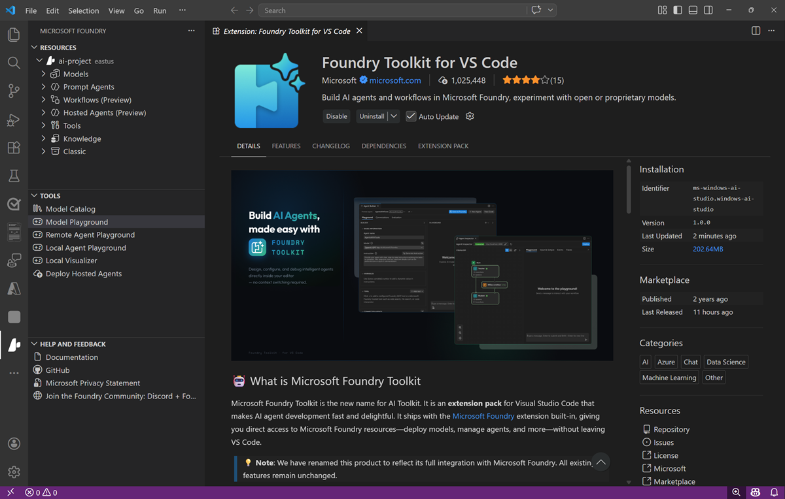
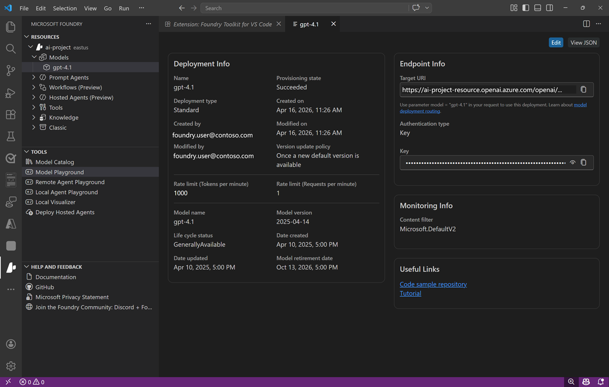
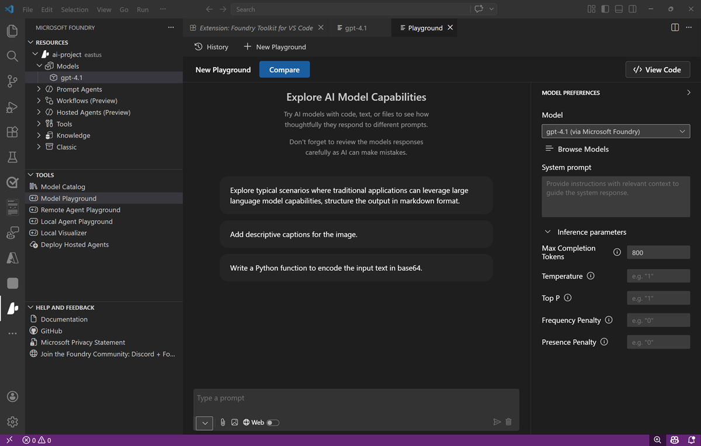

---
lab:
    title: 'Task 3 – Explore your project from Visual Studio Code'
    description: 'Install the Foundry Toolkit extension for Visual Studio Code and work with your Wingtip Journeys project, model deployments, and playground without leaving your editor.'
    level: 200
    concepts: 'Foundry Toolkit for VS Code, model deployments, model playground'
    islab: true
    status: 'draft'
---

# Task 3 — Explore your project from Visual Studio Code

*Part of the **Choose, evaluate, and safeguard a model** lab. New here? Start with [Getting started](A0-getting-started.md).*

> **What you need:** a **Microsoft Foundry project with a deployed model**, and
> [Visual Studio Code](https://code.visualstudio.com/) installed on your local machine. Don't
> have a project yet? Complete [Getting started](A0-getting-started.md) first. No local code
> or `.env` file is required for this task.

> **Continuing from a previous task?** If you just finished
> [Task 1](A1-create-a-project-and-deploy-a-model.md) or
> [Task 2](A2-compare-models.md), your project and its `gpt-5.2` deployment are exactly what
> this task expects — keep the Foundry portal tab open and start at step 1 below.

---

As a developer, you may spend some time in the Foundry portal; but you're also likely to spend
a lot of time in Visual Studio Code. The **Foundry Toolkit** extension provides a convenient
way to work with Foundry project resources without leaving the development environment.

<style>
/* "Ask Wren" just-in-time concept blocks */
details.concept { margin:.6rem 0 1rem; }
details.concept > summary { display:inline-block; cursor:pointer; list-style:none;
  font-size:.85em; font-weight:600; color:#0f6cbd; background:#0f6cbd12;
  border:1px solid #0f6cbd33; border-radius:999px; padding:.2em .7em; }
details.concept > summary::-webkit-details-marker { display:none; }
details.concept > summary::before { content:"Ask Wren: "; font-weight:700; }
details.concept > summary:hover { background:#0f6cbd; color:#fff; border-color:#0f6cbd; }
details.concept[open] > summary { border-bottom-left-radius:0; border-bottom-right-radius:0; }
details.concept .concept-body { border:1px solid #0f6cbd33; border-top:none;
  border-radius:0 8px 8px 8px; padding:.6rem .9rem; background:#0f6cbd08; font-size:.95em; }
</style>

<details markdown="1" class="concept">
<summary>Why bother, when the portal already works?</summary>
<div class="concept-body" markdown="1">

Two reasons. First, **context switching costs**: iterating on a system prompt is much faster
when the playground sits next to the code that will ship that prompt. Second, **discoverability**:
the extension shows your project's deployments in a tree, so copying the exact deployment name
or project endpoint into your `.env` becomes a right-click instead of a hunt through the portal.

</div>
</details>

## Install the Foundry Toolkit extension for Visual Studio Code

1. Start Visual Studio Code.
1. In the navigation bar on the left, view the **Extensions** page.
1. Search the extensions marketplace for `Foundry Toolkit`, and install the **Foundry Toolkit for VS Code** extension.

    The extension may take a minute or so to install.

1. After installing the extension, select the **Foundry Toolkit** page in the left navigation bar; and wait for it to load.

    

## Connect to your Wingtip Journeys project

1. In the Foundry Toolkit pane, expand **Microsoft Foundry Resources** and set the default project by connecting to Azure (signing in with your credentials) and selecting the Foundry project you created previously.

1. After setting the default project, expand the project, expand **Models**, and select the **gpt-5.2** model you deployed previously.

    You can view the model deployment details here.

    

## Test the model without leaving the editor

1. In the Foundry Toolkit pane, in the **Developer Tools** section, expand **Build** and select **Model playground**. Then select the **gpt-5.2** model (if it is not already selected).

    An interactive playground in which you can test the model is opened in Visual Studio Code.

    

1. Try a Wingtip Journeys prompt in the editor playground, for example:

    ```
   Suggest a five-day small-group itinerary in northern Portugal for travelers who care most about food.
    ```

> ✅ **Checkpoint**: Your Foundry project is connected in Visual Studio Code, and you can
> inspect deployments and test prompts without opening a browser.

**Stretch**: right-click your project deployment in the extension tree and choose
**Copy Project Endpoint**. That's the value you'll paste into a `.env` file in the companion
lab, [Build a generative AI chat app](B-build-a-generative-ai-chat-app.md).

---

**Next (optional):** [Task 4 — Evaluate a model with a synthetic dataset](A4-evaluate-a-model.md)
